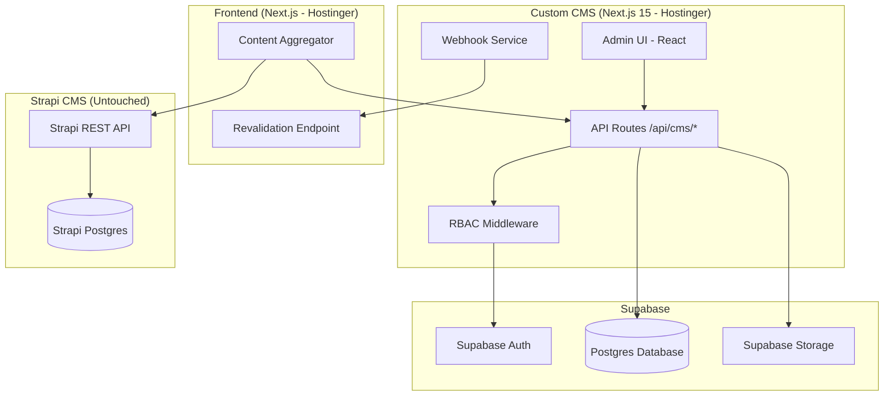
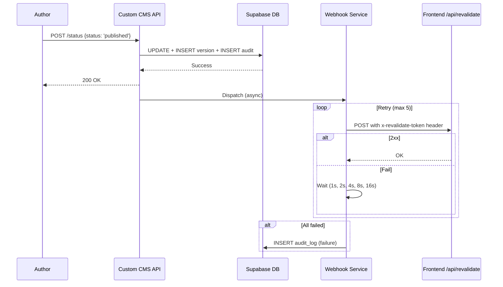

# Design Document: CMS Independence Refactor

## Overview

This design specifies the architecture for refactoring the Custom CMS into a fully independent system with its own Supabase Postgres database, REST API layer, RBAC enforcement, media management, and webhook-based revalidation. The Frontend becomes CMS-agnostic, merging content from both Strapi (historical) and the Custom CMS (new content).

**Key Design Decisions:**
- **Version History**: Immutable versioned snapshot table (not mutable row + audit trail)
- **RBAC Enforcement**: Centralized `withRbac()` higher-order function wrapping route handlers
- **Slug Resolution**: Iterative suffix algorithm with combined collision set
- **Audit Retention**: Supabase pg_cron scheduled job for 90-day cleanup

**Assumptions:**
- Supabase project is on a paid plan (required for pg_cron, Storage)
- Hostinger Node.js hosting supports Next.js 15 standalone output
- Strapi API remains accessible read-only from the Frontend
- The 18 content types share a common base pattern with type-specific fields

## Architecture

### High-Level System Diagram



---

## 3. RBAC Enforcement Model

### 3.1 Architecture: Centralized Middleware + Per-Route Declaration

Permission checks live in a **shared utility** (`/src/lib/rbac.ts`) exposed as a `withAuth()` higher-order function. Each route handler declares what it needs; the utility does the enforcement.

```typescript
// Route handler example
export const POST = withAuth(
  { resource: 'article', action: 'create' },
  async (req, user, scope) => {
    // user is guaranteed authenticated + authorized
    // scope is 'all' or 'own' — handler uses it to filter queries
  }
);
```

**Enforcement flow:**
1. Extract session from `sb-access-token` cookie → Supabase `getUser()` → lookup `cms_users` by `supabase_uid`
2. If Supabase token is missing or invalid → return 401 Unauthorized (no fallback)
3. Load permissions from `v_cms_user_permissions` view
4. Check `can(user, resource, action)` → allow/deny
5. Return `scope` to handler for row-level filtering

**Note on rbacBridge.ts removal:** The existing `rbacBridge.ts` module builds an `AuthUser` from the `admin_session` HMAC cookie without hitting Supabase Auth. This was a fallback for when the DB was unreachable. Per Requirement 11 (Supabase Auth only, no JWT fallback), **this module will be deleted entirely**. The `admin_session` HMAC cookie itself is also removed. Auth resolution has exactly one path: `sb-access-token` → Supabase `getUser()` → DB lookup. If Supabase Auth is unreachable, the API returns 503. If the DB is unreachable after Supabase validates the token, the API returns 503. There is no "degraded mode" that trusts a local token without server-side validation.

### 3.2 AI Generation Permission Gate

```typescript
// In /api/ai/generate route:
export const POST = withAuth(
  { resource: 'article', action: 'create' }, // base permission
  async (req, user) => {
    // Additional AI-specific gate
    const hasAiAccess = await checkAiPermission(user);
    if (!hasAiAccess) return json({ error: 'AI generation permission required' }, 403);

    // Rate limit check
    const usage = await getTodayUsage(user.id);
    const limit = await getAiDailyLimit();
    if (usage >= limit) return json({ error: 'Daily limit reached', resetsAt: getMidnightUTC() }, 429);

    // Proceed with generation...
  }
);

async function checkAiPermission(user: AuthUser): Promise<boolean> {
  // Admin/super_admin always have access (unless explicitly revoked)
  if (['super_admin', 'admin'].includes(user.cms_role)) {
    const revoked = await db.from('cms_ai_permissions')
      .select('revoked_at').eq('user_id', user.id).single();
    return !revoked?.data?.revoked_at;
  }
  // Other roles: check explicit grant
  const grant = await db.from('cms_ai_permissions')
    .select('is_active').eq('user_id', user.id).eq('is_active', true).single();
  return !!grant?.data;
}
```

### 3.3 Permission Matrix

| Role | Articles | Ads | Users | Media | Categories/Tags | Analytics | Settings | AI |
|------|----------|-----|-------|-------|----------------|-----------|----------|-----|
| super_admin | CRUD+P (all) | CRUD (all) | CRUD+M (all) | CRD (all) | CRUD (all) | R (all) | RU | ✓ default |
| admin | CRUD+P (all) | CRUD (all) | CRU+M (all) | CRD (all) | CRUD (all) | R (all) | RU | ✓ default |
| editor | CRU+P (all) | — | R (all) | CRD (all) | CRU (all) | R (all) | — | grant required |
| author | CRU (own) | — | R (own) | CRD (own) | R (all) | — | — | grant required |
| reporter | CRU (own) | — | — | CR (own) | R (all) | — | — | grant required |
| contributor | CR (own) | — | — | CR (own) | R (all) | — | — | grant required |
| advertiser | — | CRUD (own) | — | — | — | R (own) | — | grant required |

Legend: C=create, R=read, U=update, D=delete, P=publish, M=manage_users

---

## 4. Slug Resolution & Auto-Suffix Algorithm

### 4.1 Algorithm (server-side, at creation time)

Slug uniqueness is checked **only against the Custom CMS's own database**. There is no runtime call to Strapi for slug collision detection. The two namespaces are independent — if a Custom CMS slug happens to match a Strapi slug, the Frontend's slug resolution (Custom CMS first, Strapi fallback) handles routing correctly. This eliminates the last runtime coupling between the Custom CMS and Strapi.

```typescript
async function resolveSlug(
  baseSlug: string,
  tableName: string
): Promise<string> {
  // 1. Normalize: lowercase, replace spaces/special chars with hyphens
  let slug = baseSlug
    .toLowerCase()
    .replace(/[^a-z0-9\u0900-\u097F-]/g, '-') // allow Devanagari
    .replace(/-+/g, '-')
    .replace(/^-|-$/g, '');

  // 2. Check Custom CMS namespace only
  const existing = await db.from(tableName)
    .select('slug')
    .like('slug', `${slug}%`)
    .order('slug', { ascending: true });

  const existingSlugs = new Set(existing.data?.map(r => r.slug) ?? []);

  // 3. If base slug is free in OUR namespace, use it
  if (!existingSlugs.has(slug)) return slug;

  // 4. Auto-suffix with incrementing number
  let counter = 2;
  while (existingSlugs.has(`${slug}-${counter}`)) {
    counter++;
  }
  return `${slug}-${counter}`;
}
```

**Key properties:**
- Never blocks creation — always resolves
- Zero Strapi calls — slug checked only against Custom CMS's own DB
- Suffix starts at `-2` (not `-1`) for readability
- If a Custom CMS slug matches a Strapi slug, the Frontend slug resolution handles it (Custom CMS takes precedence on detail pages)

### Version History Strategy: Immutable Snapshot Table

**Decision:** Use an immutable `cms_content_versions` table storing full JSON snapshots.

**Justification:**
1. **Auditability** — Every published/updated state is preserved as an immutable row
2. **Rollback simplicity** — Restoring = copying snapshot JSON into a new version row
3. **Separation of concerns** — Audit log tracks who/what/when; version table tracks content state
4. **Storage trade-off** — Snapshots are typically 5-50 KB each; Supabase storage is cheap

**Alternative rejected:** Mutable row + audit trail conflates change tracking with content recovery, making rollback complex (must replay diffs).

## Components and Interfaces

### 1. Database Layer (Supabase Postgres)
All tables in `public` schema of Custom CMS's own Supabase project. Zero references to Strapi.

### 2. API Layer (Next.js Route Handlers)
RESTful endpoints under `/api/cms/` following App Router conventions. Standard CRUD per content type.

### 3. RBAC Layer (Shared Library)
Centralized permission enforcement via `withRbac(resource, action, handler)` HOF.

### 4. Webhook Service
Fire-and-forget dispatch with exponential backoff retry (in-memory queue).

### 5. Frontend Aggregator
Service layer querying both Custom CMS and Strapi, merging/deduplicating results.

## Data Models

### Common Conventions
- All primary keys: `id UUID DEFAULT gen_random_uuid()`
- All tables: `created_at TIMESTAMPTZ DEFAULT NOW()`, `updated_at TIMESTAMPTZ DEFAULT NOW()`
- Editorial workflow tables: `published_at TIMESTAMPTZ`, `status TEXT DEFAULT 'draft'`
- Slug columns: `slug TEXT NOT NULL` with UNIQUE constraint per table
- Auto-update: `updated_at` via `moddatetime` trigger

### Core Content Tables

```sql
-- 1. CATEGORIES
CREATE TABLE cms_categories (
  id UUID PRIMARY KEY DEFAULT gen_random_uuid(),
  slug TEXT NOT NULL UNIQUE,
  title_hindi TEXT NOT NULL,
  title_english TEXT NOT NULL,
  description TEXT,
  parent_id UUID REFERENCES cms_categories(id) ON DELETE SET NULL,
  sort_order INT DEFAULT 0,
  is_active BOOLEAN DEFAULT true,
  created_at TIMESTAMPTZ DEFAULT NOW(),
  updated_at TIMESTAMPTZ DEFAULT NOW()
);

-- 2. AUTHORS
CREATE TABLE cms_authors (
  id UUID PRIMARY KEY DEFAULT gen_random_uuid(),
  slug TEXT NOT NULL UNIQUE,
  name TEXT NOT NULL,
  name_hindi TEXT,
  email TEXT UNIQUE,
  avatar_url TEXT,
  cover_image TEXT,
  bio TEXT,
  designation TEXT,
  profession TEXT,
  experience TEXT,
  website_url TEXT,
  linkedin_url TEXT,
  facebook_url TEXT,
  instagram_url TEXT,
  twitter_url TEXT,
  whatsapp_url TEXT,
  role TEXT DEFAULT 'author' CHECK (role IN ('admin','editor','author','contributor')),
  is_active BOOLEAN DEFAULT true,
  created_at TIMESTAMPTZ DEFAULT NOW(),
  updated_at TIMESTAMPTZ DEFAULT NOW()
);

-- 3. TAGS
CREATE TABLE cms_tags (
  id UUID PRIMARY KEY DEFAULT gen_random_uuid(),
  slug TEXT NOT NULL UNIQUE,
  name TEXT NOT NULL,
  name_hindi TEXT,
  created_at TIMESTAMPTZ DEFAULT NOW(),
  updated_at TIMESTAMPTZ DEFAULT NOW()
);

-- 4. MEDIA
CREATE TABLE cms_media (
  id UUID PRIMARY KEY DEFAULT gen_random_uuid(),
  filename TEXT NOT NULL,
  original_name TEXT NOT NULL,
  mime_type TEXT NOT NULL,
  size_bytes BIGINT NOT NULL,
  width_px INT,
  height_px INT,
  alt_text TEXT,
  storage_path TEXT NOT NULL,
  url_original TEXT NOT NULL,
  url_thumbnail TEXT,
  url_medium TEXT,
  url_large TEXT,
  variant_status TEXT DEFAULT 'pending' CHECK (variant_status IN ('pending','complete','failed')),
  uploaded_by UUID REFERENCES cms_users(id) ON DELETE SET NULL,
  created_at TIMESTAMPTZ DEFAULT NOW(),
  updated_at TIMESTAMPTZ DEFAULT NOW()
);
```

---

## 5. Frontend Aggregation Contract

### 5.1 Unified Response Shape

```typescript
interface AggregatedListResponse<T> {
  data: Array<T & { _source: 'strapi' | 'custom-cms' }>;
  meta: {
    pagination: {
      page: number;
      pageSize: number;
      pageCount: number;
      total: number; // Combined total from both sources
    };
    sources: {
      strapi: { total: number; available: boolean };
      customCms: { total: number; available: boolean };
    };
  };
}

// Single item response
interface AggregatedItemResponse<T> {
  data: T & { _source: 'strapi' | 'custom-cms' } | null;
  meta: { resolvedFrom: 'strapi' | 'custom-cms' | null };
}
```

### 5.2 Aggregation Strategy (Frontend service layer)

```typescript
async function getAggregatedArticles(params: ListParams): Promise<AggregatedListResponse<Article>> {
  const [customResult, strapiResult] = await Promise.allSettled([
    fetchCustomCms('/api/public/articles', params, { timeout: 5000 }),
    fetchStrapi('/articles', params, { timeout: 5000 }),
  ]);

  const customData = customResult.status === 'fulfilled' ? customResult.value : { data: [], total: 0 };
  const strapiData = strapiResult.status === 'fulfilled' ? strapiResult.value : { data: [], total: 0 };

  // Tag each item with source
  const customItems = customData.data.map(item => ({ ...item, _source: 'custom-cms' as const }));
  const strapiItems = strapiData.data.map(item => ({ ...item, _source: 'strapi' as const }));

  // Merge: newest first, deduplicate by slug (Custom CMS wins on rare collisions)
  // NOTE: True slug collisions between sources should be extremely rare because:
  // 1. The architecture is split-by-time: historical content stays in Strapi, new content goes to Custom CMS
  // 2. The same content is never created in both systems simultaneously
  // 3. This dedup is a safety net for the unlikely edge case where a new Custom CMS article
  //    happens to use a slug that already exists in Strapi (e.g., re-covering the same topic).
  //    In that case, the Custom CMS version (newer) takes precedence in listings.
  const slugsSeen = new Set<string>();
  const merged = [...customItems, ...strapiItems]
    .sort((a, b) => new Date(b.published_at).getTime() - new Date(a.published_at).getTime())
    .filter(item => {
      if (slugsSeen.has(item.slug)) return false;
      slugsSeen.add(item.slug);
      return true;
    });

  // Paginate the merged result
  const start = (params.page - 1) * params.pageSize;
  const pageData = merged.slice(start, start + params.pageSize);
  const total = customData.total + strapiData.total;

  return {
    data: pageData,
    meta: {
      pagination: { page: params.page, pageSize: params.pageSize, pageCount: Math.ceil(total / params.pageSize), total },
      sources: {
        strapi: { total: strapiData.total, available: strapiResult.status === 'fulfilled' },
        customCms: { total: customData.total, available: customResult.status === 'fulfilled' },
      },
    },
  };
}
```

### 5.3 Slug Resolution (detail pages)

```typescript
async function resolveBySlug(contentType: string, slug: string): Promise<AggregatedItemResponse<any>> {
  // Custom CMS first
  const customItem = await fetchCustomCms(`/api/public/${contentType}/${slug}`, { timeout: 5000 }).catch(() => null);
  if (customItem?.data) {
    return { data: { ...customItem.data, _source: 'custom-cms' }, meta: { resolvedFrom: 'custom-cms' } };
  }

  // Fallback to Strapi
  const strapiItem = await fetchStrapi(`/${contentType}?filters[slug][$eq]=${slug}`, { timeout: 5000 }).catch(() => null);
  if (strapiItem?.data?.[0]) {
    return { data: { ...normalizeStrapi(strapiItem.data[0]), _source: 'strapi' }, meta: { resolvedFrom: 'strapi' } };
  }

  return { data: null, meta: { resolvedFrom: null } };
}
```

### 5.4 Cross-Source Pagination

Since we can't do true offset-based pagination across two sources with different totals, the approach is:
- Fetch a larger window from each source (e.g., 2× pageSize from each) to ensure merge quality
- The `total` in metadata is approximate (sum of both source totals minus estimated duplicates)
- For listing pages, this provides a good-enough UX; exact counts are secondary to content freshness

---

## 6. Webhook/Revalidation Flow

### 6.1 Sequence Diagram

```
CMS Admin → [Publish action]
    │
    ▼
Custom CMS API (/api/content/articles/[id]/transition)
    │
    ├── 1. Validate status transition (approved → published)
    ├── 2. Create new version snapshot
    ├── 3. Update article status + published_at
    ├── 4. Write audit log entry
    │
    ▼ (async, non-blocking)
Webhook Dispatcher
    │
    ├── 5. Derive revalidation paths:
    │       - /<category>/<slug> (detail page)
    │       - /<category> (listing page)
    │       - / (homepage)
    │       - /authors/<author-slug> (author page)
    │
    ├── 6. POST to Frontend revalidation endpoint:
    │       URL: ${FRONTEND_URL}/api/revalidate
    │       Headers: { 'x-revalidate-token': REVALIDATION_SECRET, 'Content-Type': 'application/json' }
    │       Body: { paths: [...], contentType: 'article', slug, source: 'custom-cms' }
    │
    └── 7. On failure → retry with exponential backoff
            Attempt 1: wait 1s
            Attempt 2: wait 2s
            Attempt 3: wait 4s
            Attempt 4: wait 8s
            Attempt 5: wait 16s
            All failed → log to cms_audit_log with action='webhook_failed'
```

### 6.2 Implementation

```typescript
async function dispatchRevalidation(contentType: string, item: PublishedItem): Promise<void> {
  const paths = deriveRevalidationPaths(contentType, item);
  const payload = { paths, contentType, slug: item.slug, source: 'custom-cms', publishedAt: item.published_at };

  const maxRetries = 5;
  const baseDelay = 1000;

  for (let attempt = 0; attempt <= maxRetries; attempt++) {
    try {
      const res = await fetch(`${process.env.FRONTEND_URL}/api/revalidate`, {
        method: 'POST',
        headers: {
          'Content-Type': 'application/json',
          'x-revalidate-token': process.env.REVALIDATION_SECRET!,
        },
        body: JSON.stringify(payload),
        signal: AbortSignal.timeout(10000),
      });

      if (res.ok || res.status === 401) return; // 401 = bad token, don't retry
      if (attempt === maxRetries) throw new Error(`HTTP ${res.status}`);
    } catch (err) {
      if (attempt === maxRetries) {
        await auditLog({ action: 'webhook_failed', resource: contentType, resource_id: item.id,
          meta: { error: (err as Error).message, paths, attempt } });
        return;
      }
      await sleep(baseDelay * Math.pow(2, attempt));
    }
  }
}
```

### 6.3 Frontend Revalidation Endpoint

The Frontend's `/api/revalidate` route:
1. Verifies `x-revalidate-token` header matches `REVALIDATION_SECRET` env var
2. Calls `revalidatePath()` for each path in the payload
3. Returns 200 on success, 401 on bad token

Strapi's existing webhooks continue to fire at the same endpoint independently — no interference.

```sql
-- 5. ARTICLES (primary content type)
CREATE TABLE cms_articles (
  id UUID PRIMARY KEY DEFAULT gen_random_uuid(),
  slug TEXT NOT NULL UNIQUE,
  title TEXT NOT NULL,
  title_hindi TEXT,
  excerpt TEXT,
  excerpt_hindi TEXT,
  content JSONB,
  content_html TEXT,
  featured_media_id UUID REFERENCES cms_media(id) ON DELETE SET NULL,
  category_id UUID REFERENCES cms_categories(id) ON DELETE SET NULL,
  author_id UUID REFERENCES cms_authors(id) ON DELETE SET NULL,
  status TEXT DEFAULT 'draft' CHECK (status IN ('draft','pending_review','approved','published','archived')),
  is_featured BOOLEAN DEFAULT false,
  is_breaking BOOLEAN DEFAULT false,
  is_editors_pick BOOLEAN DEFAULT false,
  is_todays_top BOOLEAN DEFAULT false,
  read_time TEXT,
  views BIGINT DEFAULT 0,
  seo_title TEXT,
  meta_description TEXT,
  og_title TEXT,
  og_description TEXT,
  canonical_url TEXT,
  news_keywords TEXT,
  schema_json JSONB,
  video_url TEXT,
  video_type TEXT CHECK (video_type IN ('youtube','upload','none')),
  location TEXT,
  short_headline TEXT,
  published_at TIMESTAMPTZ,
  scheduled_at TIMESTAMPTZ,
  created_by UUID REFERENCES cms_users(id) ON DELETE SET NULL,
  created_at TIMESTAMPTZ DEFAULT NOW(),
  updated_at TIMESTAMPTZ DEFAULT NOW()
);

CREATE TABLE cms_article_tags (
  article_id UUID REFERENCES cms_articles(id) ON DELETE CASCADE,
  tag_id UUID REFERENCES cms_tags(id) ON DELETE CASCADE,
  PRIMARY KEY (article_id, tag_id)
);

-- 6. PAGES
CREATE TABLE cms_pages (
  id UUID PRIMARY KEY DEFAULT gen_random_uuid(),
  slug TEXT NOT NULL UNIQUE,
  title TEXT NOT NULL,
  title_hindi TEXT,
  content JSONB,
  content_html TEXT,
  status TEXT DEFAULT 'draft' CHECK (status IN ('draft','pending_review','approved','published','archived')),
  seo_title TEXT,
  meta_description TEXT,
  published_at TIMESTAMPTZ,
  created_by UUID REFERENCES cms_users(id) ON DELETE SET NULL,
  created_at TIMESTAMPTZ DEFAULT NOW(),
  updated_at TIMESTAMPTZ DEFAULT NOW()
);
```

```sql
-- 7. EDITORIALS
CREATE TABLE cms_editorials (
  id UUID PRIMARY KEY DEFAULT gen_random_uuid(),
  slug TEXT NOT NULL UNIQUE,
  title TEXT NOT NULL,
  title_hindi TEXT,
  excerpt TEXT,
  excerpt_hindi TEXT,
  content JSONB,
  content_html TEXT,
  editorial_type TEXT DEFAULT 'editorial' CHECK (editorial_type IN ('editorial','opinion','review','interview','special-report')),
  featured_media_id UUID REFERENCES cms_media(id) ON DELETE SET NULL,
  author_id UUID REFERENCES cms_authors(id) ON DELETE SET NULL,
  status TEXT DEFAULT 'draft' CHECK (status IN ('draft','pending_review','approved','published','archived')),
  is_featured BOOLEAN DEFAULT false,
  is_editors_pick BOOLEAN DEFAULT false,
  read_time TEXT,
  views BIGINT DEFAULT 0,
  seo_title TEXT,
  meta_description TEXT,
  canonical_url TEXT,
  published_at TIMESTAMPTZ,
  scheduled_at TIMESTAMPTZ,
  created_by UUID REFERENCES cms_users(id) ON DELETE SET NULL,
  created_at TIMESTAMPTZ DEFAULT NOW(),
  updated_at TIMESTAMPTZ DEFAULT NOW()
);

-- 8. EVENTS
CREATE TABLE cms_events (
  id UUID PRIMARY KEY DEFAULT gen_random_uuid(),
  slug TEXT NOT NULL UNIQUE,
  title TEXT NOT NULL,
  title_hindi TEXT,
  description JSONB,
  description_html TEXT,
  location TEXT,
  event_date TIMESTAMPTZ,
  end_date TIMESTAMPTZ,
  category_id UUID REFERENCES cms_categories(id) ON DELETE SET NULL,
  featured_media_id UUID REFERENCES cms_media(id) ON DELETE SET NULL,
  status TEXT DEFAULT 'draft' CHECK (status IN ('draft','pending_review','approved','published','archived')),
  published_at TIMESTAMPTZ,
  created_by UUID REFERENCES cms_users(id) ON DELETE SET NULL,
  created_at TIMESTAMPTZ DEFAULT NOW(),
  updated_at TIMESTAMPTZ DEFAULT NOW()
);

-- 9. EXAMS
CREATE TABLE cms_exams (
  id UUID PRIMARY KEY DEFAULT gen_random_uuid(),
  slug TEXT NOT NULL UNIQUE,
  title TEXT NOT NULL,
  title_hindi TEXT,
  description JSONB,
  description_html TEXT,
  exam_date TIMESTAMPTZ,
  result_date TIMESTAMPTZ,
  organization TEXT,
  category_id UUID REFERENCES cms_categories(id) ON DELETE SET NULL,
  status TEXT DEFAULT 'draft' CHECK (status IN ('draft','pending_review','approved','published','archived')),
  published_at TIMESTAMPTZ,
  created_by UUID REFERENCES cms_users(id) ON DELETE SET NULL,
  created_at TIMESTAMPTZ DEFAULT NOW(),
  updated_at TIMESTAMPTZ DEFAULT NOW()
);
```

```sql
-- 10. HOLIDAYS
CREATE TABLE cms_holidays (
  id UUID PRIMARY KEY DEFAULT gen_random_uuid(),
  slug TEXT NOT NULL UNIQUE,
  title TEXT NOT NULL,
  title_hindi TEXT,
  description JSONB,
  description_html TEXT,
  holiday_date DATE NOT NULL,
  holiday_type TEXT,
  status TEXT DEFAULT 'draft' CHECK (status IN ('draft','pending_review','approved','published','archived')),
  published_at TIMESTAMPTZ,
  created_by UUID REFERENCES cms_users(id) ON DELETE SET NULL,
  created_at TIMESTAMPTZ DEFAULT NOW(),
  updated_at TIMESTAMPTZ DEFAULT NOW()
);

-- 11. INSTITUTIONS
CREATE TABLE cms_institutions (
  id UUID PRIMARY KEY DEFAULT gen_random_uuid(),
  slug TEXT NOT NULL UNIQUE,
  title TEXT NOT NULL,
  title_hindi TEXT,
  description JSONB,
  description_html TEXT,
  institution_type TEXT,
  address TEXT,
  city TEXT,
  district TEXT,
  contact_phone TEXT,
  contact_email TEXT,
  website TEXT,
  category_id UUID REFERENCES cms_categories(id) ON DELETE SET NULL,
  featured_media_id UUID REFERENCES cms_media(id) ON DELETE SET NULL,
  status TEXT DEFAULT 'draft' CHECK (status IN ('draft','pending_review','approved','published','archived')),
  published_at TIMESTAMPTZ,
  created_by UUID REFERENCES cms_users(id) ON DELETE SET NULL,
  created_at TIMESTAMPTZ DEFAULT NOW(),
  updated_at TIMESTAMPTZ DEFAULT NOW()
);

-- 12. PLACES
CREATE TABLE cms_places (
  id UUID PRIMARY KEY DEFAULT gen_random_uuid(),
  slug TEXT NOT NULL UNIQUE,
  title TEXT NOT NULL,
  title_hindi TEXT,
  description JSONB,
  description_html TEXT,
  address TEXT,
  city TEXT,
  district TEXT,
  latitude DECIMAL(10,7),
  longitude DECIMAL(10,7),
  place_type TEXT,
  category_id UUID REFERENCES cms_categories(id) ON DELETE SET NULL,
  featured_media_id UUID REFERENCES cms_media(id) ON DELETE SET NULL,
  status TEXT DEFAULT 'draft' CHECK (status IN ('draft','pending_review','approved','published','archived')),
  published_at TIMESTAMPTZ,
  created_by UUID REFERENCES cms_users(id) ON DELETE SET NULL,
  created_at TIMESTAMPTZ DEFAULT NOW(),
  updated_at TIMESTAMPTZ DEFAULT NOW()
);
```

```sql
-- 13. RESTAURANTS
CREATE TABLE cms_restaurants (
  id UUID PRIMARY KEY DEFAULT gen_random_uuid(),
  slug TEXT NOT NULL UNIQUE,
  title TEXT NOT NULL,
  title_hindi TEXT,
  description JSONB,
  description_html TEXT,
  address TEXT,
  city TEXT,
  district TEXT,
  cuisine_type TEXT,
  price_range TEXT,
  contact_phone TEXT,
  website TEXT,
  rating DECIMAL(2,1),
  category_id UUID REFERENCES cms_categories(id) ON DELETE SET NULL,
  featured_media_id UUID REFERENCES cms_media(id) ON DELETE SET NULL,
  status TEXT DEFAULT 'draft' CHECK (status IN ('draft','pending_review','approved','published','archived')),
  published_at TIMESTAMPTZ,
  created_by UUID REFERENCES cms_users(id) ON DELETE SET NULL,
  created_at TIMESTAMPTZ DEFAULT NOW(),
  updated_at TIMESTAMPTZ DEFAULT NOW()
);

-- 14. RESULTS
CREATE TABLE cms_results (
  id UUID PRIMARY KEY DEFAULT gen_random_uuid(),
  slug TEXT NOT NULL UNIQUE,
  title TEXT NOT NULL,
  title_hindi TEXT,
  content JSONB,
  content_html TEXT,
  result_type TEXT,
  result_date DATE,
  organization TEXT,
  source_url TEXT,
  category_id UUID REFERENCES cms_categories(id) ON DELETE SET NULL,
  status TEXT DEFAULT 'draft' CHECK (status IN ('draft','pending_review','approved','published','archived')),
  published_at TIMESTAMPTZ,
  created_by UUID REFERENCES cms_users(id) ON DELETE SET NULL,
  created_at TIMESTAMPTZ DEFAULT NOW(),
  updated_at TIMESTAMPTZ DEFAULT NOW()
);

-- 15. EDUCATION NEWS
CREATE TABLE cms_education_news (
  id UUID PRIMARY KEY DEFAULT gen_random_uuid(),
  slug TEXT NOT NULL UNIQUE,
  title TEXT NOT NULL,
  title_hindi TEXT,
  content JSONB,
  content_html TEXT,
  category_id UUID REFERENCES cms_categories(id) ON DELETE SET NULL,
  author_id UUID REFERENCES cms_authors(id) ON DELETE SET NULL,
  featured_media_id UUID REFERENCES cms_media(id) ON DELETE SET NULL,
  status TEXT DEFAULT 'draft' CHECK (status IN ('draft','pending_review','approved','published','archived')),
  is_featured BOOLEAN DEFAULT false,
  published_at TIMESTAMPTZ,
  created_by UUID REFERENCES cms_users(id) ON DELETE SET NULL,
  created_at TIMESTAMPTZ DEFAULT NOW(),
  updated_at TIMESTAMPTZ DEFAULT NOW()
);

-- 16. SITE SETTINGS
CREATE TABLE cms_sitesettings (
  id UUID PRIMARY KEY DEFAULT gen_random_uuid(),
  key TEXT NOT NULL UNIQUE,
  value JSONB NOT NULL,
  updated_by UUID REFERENCES cms_users(id) ON DELETE SET NULL,
  created_at TIMESTAMPTZ DEFAULT NOW(),
  updated_at TIMESTAMPTZ DEFAULT NOW()
);

-- 17. INTERNAL LINKS
CREATE TABLE cms_internal_links (
  id UUID PRIMARY KEY DEFAULT gen_random_uuid(),
  slug TEXT NOT NULL UNIQUE,
  title TEXT NOT NULL,
  title_hindi TEXT,
  target_url TEXT NOT NULL,
  anchor_text TEXT,
  link_type TEXT,
  sort_order INT DEFAULT 0,
  is_active BOOLEAN DEFAULT true,
  status TEXT DEFAULT 'draft' CHECK (status IN ('draft','pending_review','approved','published','archived')),
  published_at TIMESTAMPTZ,
  created_by UUID REFERENCES cms_users(id) ON DELETE SET NULL,
  created_at TIMESTAMPTZ DEFAULT NOW(),
  updated_at TIMESTAMPTZ DEFAULT NOW()
);

-- 18. MICROSITE ITEMS
CREATE TABLE cms_microsite_items (
  id UUID PRIMARY KEY DEFAULT gen_random_uuid(),
  slug TEXT NOT NULL UNIQUE,
  title TEXT NOT NULL,
  title_hindi TEXT,
  content JSONB,
  content_html TEXT,
  microsite_key TEXT NOT NULL,
  category_id UUID REFERENCES cms_categories(id) ON DELETE SET NULL,
  featured_media_id UUID REFERENCES cms_media(id) ON DELETE SET NULL,
  sort_order INT DEFAULT 0,
  status TEXT DEFAULT 'draft' CHECK (status IN ('draft','pending_review','approved','published','archived')),
  published_at TIMESTAMPTZ,
  created_by UUID REFERENCES cms_users(id) ON DELETE SET NULL,
  created_at TIMESTAMPTZ DEFAULT NOW(),
  updated_at TIMESTAMPTZ DEFAULT NOW()
);
```

---

## 7. Migration/Setup Plan

### Order of Operations (zero Strapi downtime)

**Phase 1: Schema & Infrastructure (no code changes to live CMS)**
1. Create all new tables in Supabase Postgres (run DDL migrations via Supabase dashboard or MCP tool)
2. Enable `pg_cron` extension (if available) for audit log cleanup
3. Create Supabase Storage bucket `cms-media` with public access policy
4. Seed `cms_permissions` table with permissions for `reporter` and `contributor` roles
5. Create `cms_ai_config` row with default `daily_limit = 20`
6. Insert initial `cms_site_settings` row
7. Migrate existing `ads` → `cms_ads`: run script that copies all campaigns with UUID generation, plus `ad_impressions`/`ad_clicks` with updated FK references
8. **Reconciliation gate (must pass before proceeding):**
   - Run `COUNT(*)` on `ads` vs `cms_ads`, `ad_impressions` vs `cms_ad_impressions`, `ad_clicks` vs `cms_ad_clicks`. Counts must match exactly. Any mismatch must be investigated and documented before moving forward.
   - Spot-check a sample (e.g., 10 records per table) comparing source row values to migrated row values, including correct UUID remapping of foreign keys.

**Phase 2: Backend Implementation (Custom CMS)**
1. Create shared libraries:
   - `/src/lib/schemas/` — Zod schemas for all 18 content types
   - `/src/lib/db-client.ts` — Supabase client wrapper (replace current `db.ts`)
   - `/src/lib/rbac.ts` — Extend existing with new roles + AI permission checks
   - `/src/lib/slug.ts` — Slug resolution algorithm
   - `/src/lib/webhook.ts` — Revalidation dispatcher
   - `/src/lib/media.ts` — Supabase Storage upload + variant generation
   - `/src/lib/audit.ts` — Audit log writer
   - `/src/lib/versioning.ts` — Version snapshot creator + rollback
2. Implement public API routes (`/api/public/[content-type]`)
3. Implement admin content CRUD routes (`/api/content/[content-type]`)
4. Implement auth routes (retain existing Supabase auth flow, remove Strapi auth)
5. Implement ads routes (migrate from current SERIAL PK to UUID)
6. Implement AI generation routes (existing logic, add rate limiting + RBAC gate)
7. Implement webhook dispatcher
8. Implement audit log query + cron cleanup route

**Phase 3: Admin UI Updates (Custom CMS)**
1. Replace `cmsApi` client with direct API calls to new `/api/content/` routes
2. Add UI pages for new content types (events, exams, holidays, etc.)
3. Update editorial workflow UI to use new status transitions
4. Add version history panel to content edit pages
5. Add AI permission management to user admin
6. Update media manager to use Supabase Storage upload

**Phase 4: Frontend Aggregation Layer**
1. Create `/src/services/cms/aggregator.ts` in Frontend
2. Implement `fetchCustomCms()` utility pointing at Custom CMS public API
3. Update each content listing to use aggregated fetch
4. Update slug resolution (detail pages) to check Custom CMS first
5. Add/update `/api/revalidate` endpoint to accept `x-revalidate-token`

**Phase 5: Cleanup & Cutover**
1. Delete `/api/cms/strapi/[...path]` route from Custom CMS
2. Delete `/api/cms/strapi-extended/[...path]` route
3. Delete `src/lib/cmsApi.ts`
4. Delete `/api/auth/strapi-refresh` route
5. Delete `/api/admin/login` route (legacy Strapi-only login)
6. Delete `src/lib/rbacBridge.ts`, `src/lib/adminSession.ts`, `src/lib/sessionSecret.ts`
7. Remove `admin_session` and `strapi_jwt` cookie handling from all auth/middleware code
8. Remove Strapi env vars from Custom CMS: `STRAPI_API_URL`, `STRAPI_API_TOKEN`, `NEXT_PUBLIC_STRAPI_*`
9. **⛔ MANUAL CHECKPOINT — Legacy ads table drop:**
   - This step is NOT part of any automated script. It runs only after:
     (a) The Phase 1 reconciliation gate has passed (row counts match, spot-check confirmed).
     (b) The `cms_ads` system has been operational in production for a reasonable period.
     (c) **Explicit owner confirmation** (you) that the drop may proceed.
   - Once confirmed: `DROP TABLE ads, ad_impressions, ad_clicks CASCADE;`
10. Run full test pass — verify zero Strapi calls from Custom CMS

**Critical constraint:** At no point during this process is Strapi modified. Strapi continues serving historical content via its existing API. The Frontend continues reading from Strapi independently.

---

## 8. Open Questions & Assumptions

### Assumptions Made (proceeding with these unless you disagree):

1. **Slug uniqueness is Custom-CMS-only:** The Custom CMS checks slugs only against its own database. No runtime call to Strapi. If a Custom CMS slug happens to match a Strapi slug, the Frontend's slug resolution (Custom CMS first, Strapi fallback) handles it — the Custom CMS version wins on detail pages. This is a rare edge case (same topic re-covered), not a routine merge behavior.

2. **`pg_cron` availability:** I'm assuming your Supabase plan supports `pg_cron`. If not, the fallback is a Next.js API route called by Hostinger's cron scheduler.

3. **Supabase Storage variant generation:** Since Hostinger has a 1024 MB heap limit, image variant generation (resize to 150/600/1200px) will use streaming `sharp` processing on the server. If `sharp` isn't available on Hostinger's Node, we'll use Supabase Edge Functions for image processing instead.

4. **`cms_admin_users` view:** I'm creating a view alias rather than a separate table — all admin users live in the existing `cms_users` table. The 7 CMS roles are sufficient; no separate "admin-user" vs "cms-user" table split is needed.

5. **Auth: Single path, no fallback.** Login is Supabase Auth only. Session is managed via `sb-access-token` cookie (Supabase-issued). The existing `rbacBridge.ts` HMAC bridge and `admin_session` cookie are **deleted entirely** — they are not load-bearing for anything in the new architecture. All existing users who only had Strapi accounts will need a Supabase Auth account created for them by an admin.

6. **Frontend aggregation timeout:** 5 seconds per source. If either source is slow, the Frontend serves what it has from the other.

7. **Legacy `ads` table disposition:** The existing `ads` table (SERIAL PK, integer IDs) will be **migrated into `cms_ads` (UUID)** during Phase 1. A one-time migration script copies all active campaigns from `ads` → `cms_ads`, generating UUIDs for each. After verification, the old `ads`, `ad_impressions`, and `ad_clicks` tables are **dropped** in Phase 5 (Cleanup). No indefinite deprecation — clean break.

### Flagged Issues from Codebase Exploration:

1. **HMAC bridge (rbacBridge.ts) — REMOVED:**
   - **What it did:** Built an `AuthUser` from the `admin_session` HMAC cookie's payload (id, email, role, exp) using the static `ROLE_PERMISSIONS` table in `permissions.ts`. Used when the Supabase DB was unreachable.
   - **Why it existed:** Allowed the CMS to show basic UI and allow reads even when the DB was down, by trusting the HMAC-signed session token directly.
   - **Why it's removed:** Per Requirement 11, auth must be Supabase Auth only with no JWT/HMAC fallback path. The HMAC bridge trusts a locally-signed token without validating against Supabase — this is exactly the kind of hidden auth dependency the requirement flagged. Since login is gated by Supabase Auth, and the session token is now the Supabase-issued `sb-access-token`, the bridge serves no purpose. If Supabase is down, the correct behavior is 503, not degraded trust.
   - **Files deleted:** `src/lib/rbacBridge.ts`, `src/lib/adminSession.ts`, `src/lib/sessionSecret.ts`
   - **Cookie removed:** `admin_session`

2. **Strapi dependencies beyond the proxy — ALL REMOVED from Custom CMS:**
   - `/api/admin/login` — authenticates via Strapi `auth/local` → **deleted**
   - `/api/auth/strapi-refresh` — re-obtains `strapi_jwt` → **deleted**
   - `/api/auth/login` (Step 6) — obtains `strapi_jwt` after Supabase login → **removed**
   - `strapi_jwt` cookie — no longer set or read by Custom CMS
   - **Zero Strapi env vars required** by Custom CMS after cutover
   - Frontend's own `/api/cms/strapi/[...path]` route → **Frontend retains this** for reading historical Strapi content (read-only, no mutation)

3. **Legacy ads table migration (explicit plan):**
   - Phase 1, Step 7: Run migration script that `INSERT INTO cms_ads ... SELECT ... FROM ads` with UUID generation for each row. Copy `ad_impressions` and `ad_clicks` with new FK references.
   - Phase 1, Step 8: Reconciliation gate — row-count match (`COUNT(*)` old vs new) + spot-check sample of 10 records per table. Mismatch = investigate, do not proceed.
   - Phase 5, Step 9: **Manual checkpoint.** `DROP TABLE ads, ad_impressions, ad_clicks CASCADE` runs ONLY after explicit owner confirmation. Not automated, not unattended. This is a destructive irreversible operation gated by human approval.

4. **Frontend slug dedup — "Custom CMS wins" is a rare safety net, not primary behavior:**
   - Since the architecture is split-by-time (historical in Strapi, new in Custom CMS), the same slug should almost never appear in both systems.
   - The only realistic scenario: a journalist re-covers a topic that already has a Strapi article with the same slug (e.g., "rampur-election-results"). Since the Custom CMS doesn't check Strapi slugs, it could create an identical slug independently.
   - When this happens in a listing, the dedup prefers the Custom CMS version (newer). On detail pages, the Frontend checks Custom CMS first by design (Requirement 7.4).
   - This is documented as a rare safety net in the aggregation code, not as a primary merge strategy.

---

*End of Design Document. Ready for implementation upon confirmation.*

### RBAC & User Tables

```sql
CREATE TABLE cms_users (
  id UUID PRIMARY KEY DEFAULT gen_random_uuid(),
  supabase_uid UUID UNIQUE REFERENCES auth.users(id) ON DELETE CASCADE,
  email TEXT NOT NULL UNIQUE,
  username TEXT NOT NULL,
  full_name TEXT,
  cms_role TEXT NOT NULL DEFAULT 'author'
    CHECK (cms_role IN ('super_admin','admin','editor','author','reporter','contributor','advertiser')),
  is_active BOOLEAN NOT NULL DEFAULT true,
  avatar_url TEXT,
  author_id UUID REFERENCES cms_authors(id) ON DELETE SET NULL,
  ai_generation_allowed BOOLEAN,
  ai_daily_limit INT,
  last_active_at TIMESTAMPTZ,
  created_by UUID REFERENCES cms_users(id) ON DELETE SET NULL,
  created_at TIMESTAMPTZ NOT NULL DEFAULT NOW(),
  updated_at TIMESTAMPTZ NOT NULL DEFAULT NOW()
);

CREATE TABLE cms_roles (
  id UUID PRIMARY KEY DEFAULT gen_random_uuid(),
  name TEXT NOT NULL UNIQUE CHECK (name IN
    ('super_admin','admin','editor','author','reporter','contributor','advertiser')),
  display_name TEXT NOT NULL,
  rank INT NOT NULL,
  ai_default BOOLEAN DEFAULT false,
  created_at TIMESTAMPTZ DEFAULT NOW()
);

CREATE TABLE cms_permissions (
  id UUID PRIMARY KEY DEFAULT gen_random_uuid(),
  role_name TEXT NOT NULL REFERENCES cms_roles(name) ON DELETE CASCADE,
  resource TEXT NOT NULL,
  action TEXT NOT NULL CHECK (action IN ('create','read','update','delete','publish','manage_users')),
  scope TEXT NOT NULL DEFAULT 'all' CHECK (scope IN ('all','own')),
  UNIQUE(role_name, resource, action)
);
```

### Version History & Audit Tables

```sql
CREATE TABLE cms_content_versions (
  id UUID PRIMARY KEY DEFAULT gen_random_uuid(),
  content_type TEXT NOT NULL,
  content_id UUID NOT NULL,
  version_num INT NOT NULL,
  snapshot JSONB NOT NULL,
  status_at TEXT NOT NULL,
  created_by UUID REFERENCES cms_users(id) ON DELETE SET NULL,
  created_at TIMESTAMPTZ NOT NULL DEFAULT NOW(),
  UNIQUE(content_type, content_id, version_num)
);
CREATE INDEX idx_versions_lookup ON cms_content_versions(content_type, content_id, created_at DESC);

CREATE TABLE cms_audit_log (
  id UUID PRIMARY KEY DEFAULT gen_random_uuid(),
  user_id UUID REFERENCES cms_users(id) ON DELETE SET NULL,
  user_email TEXT,
  cms_role TEXT,
  action TEXT NOT NULL,
  resource TEXT NOT NULL,
  resource_id TEXT,
  metadata JSONB,
  ip_address INET,
  created_at TIMESTAMPTZ NOT NULL DEFAULT NOW()
);
CREATE INDEX idx_audit_created ON cms_audit_log(created_at);
CREATE INDEX idx_audit_user ON cms_audit_log(user_id);
CREATE INDEX idx_audit_resource ON cms_audit_log(resource, resource_id);

-- 90-day cleanup via pg_cron (daily at 03:00 UTC):
-- SELECT cron.schedule('cleanup-audit-log', '0 3 * * *',
--   $$DELETE FROM cms_audit_log WHERE created_at < NOW() - INTERVAL '90 days'$$);
```

### Ads Tables

```sql
CREATE TABLE cms_ads (
  id UUID PRIMARY KEY DEFAULT gen_random_uuid(),
  title TEXT NOT NULL CHECK (char_length(title) BETWEEN 1 AND 200),
  type TEXT NOT NULL DEFAULT 'adsense' CHECK (type IN ('adsense','image','html')),
  placement TEXT NOT NULL CHECK (placement IN (
    'header','sidebar','infeed','article_top','article_middle','article_bottom',
    'footer','mobile_sticky','banner_1','banner_2','banner_3','banner_4','banner_5',
    'banner_6','banner_7','banner_8','banner_9','banner_10')),
  code TEXT,
  image_url TEXT,
  target_url TEXT,
  is_active BOOLEAN DEFAULT true,
  priority INT NOT NULL DEFAULT 1 CHECK (priority BETWEEN 1 AND 100),
  weight INT DEFAULT 50,
  device_type TEXT DEFAULT 'all' CHECK (device_type IN ('all','mobile','desktop')),
  category TEXT,
  start_date TIMESTAMPTZ,
  end_date TIMESTAMPTZ,
  created_by UUID REFERENCES cms_users(id) ON DELETE SET NULL,
  created_at TIMESTAMPTZ DEFAULT NOW(),
  updated_at TIMESTAMPTZ DEFAULT NOW()
);

CREATE TABLE cms_ad_events (
  id UUID PRIMARY KEY DEFAULT gen_random_uuid(),
  ad_id UUID NOT NULL REFERENCES cms_ads(id) ON DELETE CASCADE,
  event_type TEXT NOT NULL CHECK (event_type IN ('impression','click')),
  ip_anonymous INET,
  page_url TEXT,
  placement TEXT,
  created_at TIMESTAMPTZ NOT NULL DEFAULT NOW()
);
CREATE INDEX idx_ad_events_ad ON cms_ad_events(ad_id, event_type);
CREATE INDEX idx_ad_events_date ON cms_ad_events(created_at);
```

### Supporting Tables

```sql
CREATE TABLE cms_ai_usage (
  id UUID PRIMARY KEY DEFAULT gen_random_uuid(),
  user_id UUID NOT NULL REFERENCES cms_users(id) ON DELETE CASCADE,
  used_at TIMESTAMPTZ NOT NULL DEFAULT NOW(),
  prompt_hash TEXT
);
CREATE INDEX idx_ai_usage_user_date ON cms_ai_usage(user_id, used_at);

CREATE TABLE cms_webhook_log (
  id UUID PRIMARY KEY DEFAULT gen_random_uuid(),
  content_type TEXT NOT NULL,
  content_id UUID NOT NULL,
  target_url TEXT NOT NULL,
  status_code INT,
  error_message TEXT,
  attempt INT DEFAULT 1,
  created_at TIMESTAMPTZ NOT NULL DEFAULT NOW()
);

CREATE TABLE cms_system_config (
  key TEXT PRIMARY KEY,
  value JSONB NOT NULL,
  updated_at TIMESTAMPTZ DEFAULT NOW()
);
```

### Row Level Security

```sql
-- All tables use service_role bypass (Next.js API routes use SUPABASE_SERVICE_KEY)
-- RLS enabled but permissive for service_role:
ALTER TABLE cms_articles ENABLE ROW LEVEL SECURITY;
CREATE POLICY "service_role_all" ON cms_articles FOR ALL TO service_role USING (true);

-- Frontend anon read for published content:
CREATE POLICY "anon_read_published" ON cms_articles
  FOR SELECT TO anon USING (status = 'published');
-- (Applied to all content tables with editorial workflow)
```

### API Route Structure

All Custom CMS API routes live under `/api/cms/`. Pattern per content type:

| Method | Path | Description | Auth | RBAC |
|--------|------|-------------|------|------|
| GET | `/api/cms/{type}` | List (paginated/filtered/sorted) | Required | `read:{type}` |
| GET | `/api/cms/{type}/[id]` | Get by ID | Required | `read:{type}` |
| GET | `/api/cms/{type}/slug/[slug]` | Get by slug | Optional* | `read:{type}` |
| POST | `/api/cms/{type}` | Create | Required | `create:{type}` |
| PATCH | `/api/cms/{type}/[id]` | Update | Required | `update:{type}` |
| DELETE | `/api/cms/{type}/[id]` | Delete | Required | `delete:{type}` |
| POST | `/api/cms/{type}/[id]/status` | Change editorial status | Required | `publish:{type}` |
| GET | `/api/cms/{type}/[id]/versions` | List versions | Required | `read:{type}` |
| POST | `/api/cms/{type}/[id]/rollback` | Rollback to version | Required | `update:{type}` |

*Slug lookup unauthenticated for Frontend public reads (RLS enforces published-only).

#### Special Routes

```
/api/cms/users             GET, POST
/api/cms/users/[id]        GET, PATCH, DELETE
/api/cms/users/[id]/ai-permission  PATCH

/api/cms/ads               GET, POST
/api/cms/ads/[id]          GET, PATCH, DELETE
/api/cms/ads/impression    POST (anonymous)
/api/cms/ads/click         POST (anonymous)
/api/cms/ads/analytics     GET (admin only)

/api/cms/ai/generate       POST

/api/cms/audit-log         GET (admin only)

/api/cms/media             GET, POST (multipart)
/api/cms/media/[id]        GET, DELETE
/api/cms/media/proxy/[id]  GET (cache headers)

/api/admin/login           POST
/api/admin/logout          POST
/api/admin/me              GET
```

#### Pagination, Filter & Sort Parameters

| Parameter | Type | Default | Description |
|-----------|------|---------|-------------|
| `page` | int | 1 | Page number (1-indexed) |
| `pageSize` | int | 25 | Items per page (max: 100) |
| `sort` | string | `created_at` | Sort field |
| `order` | asc/desc | `desc` | Sort direction |
| `status` | string | — | Filter by editorial status |
| `category` | string | — | Filter by category slug |
| `search` | string | — | Full-text search in title |

#### Response Envelope

```typescript
interface ListResponse<T> {
  data: T[];
  meta: {
    pagination: {
      page: number;
      pageSize: number;
      pageCount: number;
      total: number;
    };
  };
}
```

#### Validation

Zod schemas at `src/lib/schemas/{contentType}.ts`. Route handlers call `schema.parse(body)` in try/catch, returning 400 with field-level errors on failure.

### RBAC Enforcement Model

Permission checks centralized in `src/lib/rbac.ts` via `withRbac()`:

```typescript
export const GET = withRbac('article', 'read', async (req, user, scope) => {
  const query = scope === 'own'
    ? supabase.from('cms_articles').select('*').eq('created_by', user.id)
    : supabase.from('cms_articles').select('*');
  // ...
});
```

#### AI Permission Gate

```typescript
function checkAIPermission(user: AuthUser): boolean {
  if (user.ai_generation_allowed === true) return true;
  if (user.ai_generation_allowed === false) return false;
  // Fall back to role default
  return ['super_admin', 'admin'].includes(user.cms_role);
}
```

AI endpoint chains: `withRbac` → `checkAIPermission` → rate limit → generate.

### Slug Resolution & Auto-Suffix Algorithm

Slug uniqueness is enforced **only within the Custom CMS's own database**. No Strapi calls.

```typescript
function resolveSlug(baseSlug: string, existingSlugs: Set<string>): string {
  if (!existingSlugs.has(baseSlug)) return baseSlug;

  const suffixMatch = baseSlug.match(/^(.+)-(\d+)$/);
  const root = suffixMatch ? suffixMatch[1] : baseSlug;
  let counter = suffixMatch ? parseInt(suffixMatch[2], 10) + 1 : 2;

  const MAX_ATTEMPTS = 10000;
  while (counter < MAX_ATTEMPTS) {
    const candidate = `${root}-${counter}`;
    if (!existingSlugs.has(candidate)) return candidate;
    counter++;
  }
  // Fallback: UUID fragment guarantees uniqueness
  return `${root}-${crypto.randomUUID().slice(0, 8)}`;
}
```

Integration: query `cms_{type}` table for existing slugs matching the prefix. No cross-system slug check.

### Frontend Aggregation Contract

```typescript
interface AggregatedListResponse<T> {
  data: T[];
  meta: {
    pagination: { page: number; pageSize: number; pageCount: number; total: number; };
    sources: {
      customCms: { available: boolean; count: number; };
      strapi: { available: boolean; count: number; };
    };
  };
}

interface AggregatedItem {
  id: string;
  slug: string;
  source: 'custom-cms' | 'strapi';
  publishedAt: string;
}
```

Logic: query both sources in parallel (5s timeout), tag with source indicator, sort by publishedAt desc, paginate merged result. Deduplication by slug (Custom CMS wins) is included as a rare safety net — since content is split-by-time (historical in Strapi, new in Custom CMS), slug collisions across sources should be uncommon edge cases, not routine.

### Webhook / Revalidation Flow



Retry parameters: max 5 attempts, delays [1s, 2s, 4s, 8s, 16s], 10s connection timeout, abort on 401.

### Migration / Setup Plan

**Phase 1: Schema** — Create Supabase project, run migrations (extensions → tables → RLS → seed → cron)

**Phase 2: Auth** — Configure Supabase Auth, migrate admin users, test session flow

**Phase 3: API Routes** — Implement CRUD factory, content-specific routes, media, ads, AI, webhooks

**Phase 4: Frontend** — Build aggregator service, wire dual-source queries, test merge logic

**Phase 5: Cutover** — Delete proxy files/cmsApi.ts, delete rbacBridge/adminSession modules, remove Strapi env vars, drop legacy ads tables, deploy

Key principle: Strapi never touched. It continues serving historical content unchanged.

### Open Questions

| # | Question | Impact |
|---|----------|--------|
| 1 | Is Supabase on Pro plan? (needed for pg_cron) | Audit cleanup mechanism |
| 2 | Image variants sync or async? (no workers on Hostinger) | Upload UX |
| 3 | Is Redis/ioredis available on Hostinger? | Rate limit under concurrency |
| 4 | Any Strapi content needs migration to Custom CMS? | Data migration scope (currently: no) |

## Correctness Properties

*A property is a characteristic or behavior that should hold true across all valid executions of a system — essentially, a formal statement about what the system should do. Properties serve as the bridge between human-readable specifications and machine-verifiable correctness guarantees.*

### Property 1: Slug resolution always produces a unique, non-colliding slug

*For any* base slug and *for any* set of existing slugs (including Strapi cached slugs), the `resolveSlug` function SHALL return a slug that is not contained in the existing set, and the function SHALL always terminate.

**Validates: Requirements 3.6, 3.7, 3.8**

### Property 2: Pagination respects limits and response contains required metadata

*For any* list query with page >= 1 and pageSize between 1 and 100, the response SHALL contain at most `pageSize` items, and SHALL include `meta.pagination.page`, `meta.pagination.pageSize`, `meta.pagination.pageCount`, and `meta.pagination.total` where `pageCount = ceil(total / pageSize)`.

**Validates: Requirements 3.2, 3.9**

### Property 3: Invalid input payloads are rejected with field-level errors

*For any* request body that violates the Zod schema (missing required fields, wrong types, out-of-range values), the API SHALL return HTTP 400 with a response indicating which fields failed validation.

**Validates: Requirements 3.5, 9.4**

### Property 4: Editorial state machine permits only valid transitions

*For any* content item with current status S and requested target status T, the transition SHALL succeed if and only if (S,T) is in {(draft, pending_review), (pending_review, approved), (approved, published), (published, archived), (any, draft)}. All other pairs SHALL be rejected with HTTP 400.

**Validates: Requirements 4.1, 4.2, 4.3**

### Property 5: RBAC enforcement matches the permission matrix

*For any* user with role R, resource X, and action A, the `can(user, X, A)` function SHALL return allowed=true with correct scope if and only if the permission matrix defines (R, X, A). Users with no role or inactive status SHALL always be denied.

**Validates: Requirements 5.2, 5.3, 5.8**

### Property 6: AI permission gate enforces role-based and explicit grants

*For any* user, AI generation SHALL be allowed if and only if: (a) explicit `ai_generation_allowed = true`, OR (b) no explicit override AND role is super_admin or admin. All others SHALL be denied with 403.

**Validates: Requirements 5.4, 5.5, 5.6, 10.6**

### Property 7: Frontend merge produces correct ordering, deduplication, and source tagging

*For any* two article lists from Custom CMS and Strapi with arbitrary overlapping slugs, the merged result SHALL contain each slug exactly once (Custom CMS wins on duplicates), be sorted by publishedAt descending, and tag each item with correct source indicator.

**Validates: Requirements 7.2, 7.3**

### Property 8: Frontend slug resolution checks Custom CMS first

*For any* slug existing in both sources, resolution SHALL return the Custom CMS version. *For any* slug in only one source, resolution SHALL return that source's version.

**Validates: Requirements 7.4, 7.5**

### Property 9: Frontend resilience to single-source failure

*For any* request where exactly one source is unreachable, the aggregator SHALL return results from the available source without visitor-facing error.

**Validates: Requirements 7.7**

### Property 10: Webhook dispatch does not block publish

*For any* publish operation, the content SHALL be persisted and HTTP response returned regardless of webhook delivery status.

**Validates: Requirements 8.2**

### Property 11: Webhook retry uses exponential backoff

*For any* webhook failure, retries SHALL follow delays [1s, 2s, 4s, 8s, 16s] with at most 5 attempts.

**Validates: Requirements 8.3**

### Property 12: IP anonymization zeroes correct bits

*For any* IPv4 address, anonymization SHALL zero the last octet. *For any* IPv6 address, anonymization SHALL zero the last 80 bits.

**Validates: Requirements 9.3**

### Property 13: Ad placement targeting returns only matching ads

*For any* query specifying placement, device type, and/or category, all returned ads SHALL match the specified criteria.

**Validates: Requirements 9.2**

### Property 14: AI rate limiting enforces per-user daily cap

*For any* user with daily limit N, the (N+1)th request within the same UTC day SHALL be rejected with 429. Counter resets at midnight UTC.

**Validates: Requirements 10.3, 10.5**

### Property 15: Whitespace-only prompts are rejected

*For any* string composed entirely of whitespace characters, the AI endpoint SHALL reject with 400.

**Validates: Requirements 10.8**

### Property 16: Session validation rejects invalid/expired sessions

*For any* request with missing, expired (>24h idle), malformed, or absolutely-expired (>7 days) session cookie, the API SHALL return 401.

**Validates: Requirements 11.4, 11.8**

### Property 17: Session auto-refresh at >50% idle timeout

*For any* session aged 12-24h with absolute age < 7 days, a request SHALL trigger session refresh.

**Validates: Requirements 11.6**

### Property 18: Audit logging records all mutations

*For any* CRUD operation, an audit entry SHALL be created with user_id, action, resource, resource_id, timestamp. Update operations SHALL include changed-field diff in metadata.

**Validates: Requirements 13.1, 13.2**

### Property 19: Audit cleanup removes only >90-day records

*For any* set of audit records, cleanup SHALL delete only those with `created_at < NOW() - 90 days`.

**Validates: Requirements 13.4**

### Property 20: Audit write failure does not block operations

*For any* operation where audit INSERT fails, the original CRUD operation SHALL still succeed.

**Validates: Requirements 13.7**

### Property 21: Filtering returns only matching items

*For any* list query with field filters, all items in the response SHALL match the filter criteria.

**Validates: Requirements 3.3**

### Property 22: Sorting returns correctly ordered items

*For any* list query with sort field and direction, consecutive items SHALL satisfy the ordering constraint.

**Validates: Requirements 3.4**

## Error Handling

### Error Response Format

```typescript
interface ErrorResponse {
  error: string;
  code?: string;
  details?: { field: string; message: string; }[];
  status: number;
}
```

### Strategy by Layer

| Layer | Error | Response | Side Effect |
|-------|-------|----------|-------------|
| Auth | Missing/invalid session | 401 | None |
| Auth | Supabase unreachable | 503 | Console log |
| RBAC | Insufficient permissions | 403 | None |
| Validation | Invalid body | 400 + field errors | None |
| Validation | Invalid transition | 400 + valid list | None |
| Business | Slug collision | Auto-resolve | None |
| Business | Rate limit exceeded | 429 + reset time | None |
| Storage | Upload too large | 413 | None |
| Storage | Variant gen fails | 200 + warning | Store original |
| External | AI unavailable | 503 | None |
| External | Webhook fails | Publish succeeds | Audit on final fail |
| Audit | Write fails | Op succeeds | stderr log |

## Testing Strategy

**Frameworks:** Vitest + fast-check (both already configured)

**Property-based tests** (100+ iterations each):

| Property | Test File | Generators |
|----------|-----------|------------|
| 1 (Slug) | `slug-resolution.property.test.ts` | Random slugs + collision sets |
| 4 (State machine) | `editorial-workflow.property.test.ts` | Random status pairs |
| 5 (RBAC) | `rbac-enforcement.property.test.ts` | Random role/resource/action |
| 7 (Merge) | `content-merge.property.test.ts` | Random article lists |
| 12 (IP) | `ip-anonymize.property.test.ts` | Random IPv4/IPv6 |
| 14 (Rate limit) | `rate-limit.property.test.ts` | Random request sequences |
| 19 (Cleanup) | `audit-cleanup.property.test.ts` | Random aged records |
| 21/22 (Filter/Sort) | `list-query.property.test.ts` | Random datasets + params |

**Unit/integration tests** for: auth flow, media upload, webhook retry, Zod edge cases, aggregator fallback.

Each property test tagged: `Feature: cms-independence-refactor, Property {N}: {title}`
