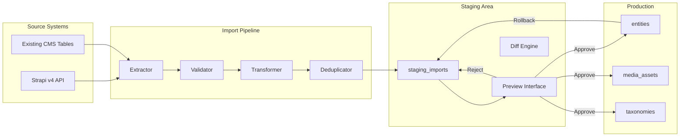
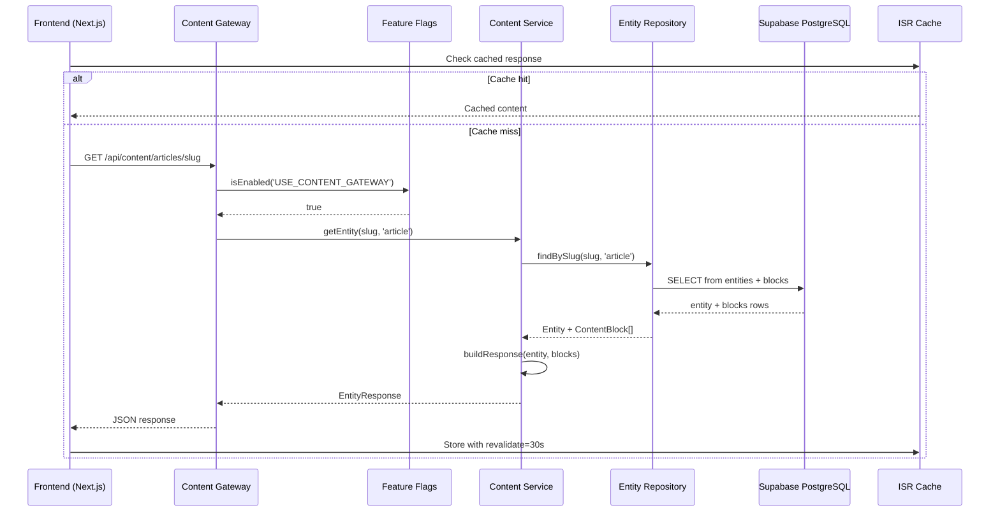
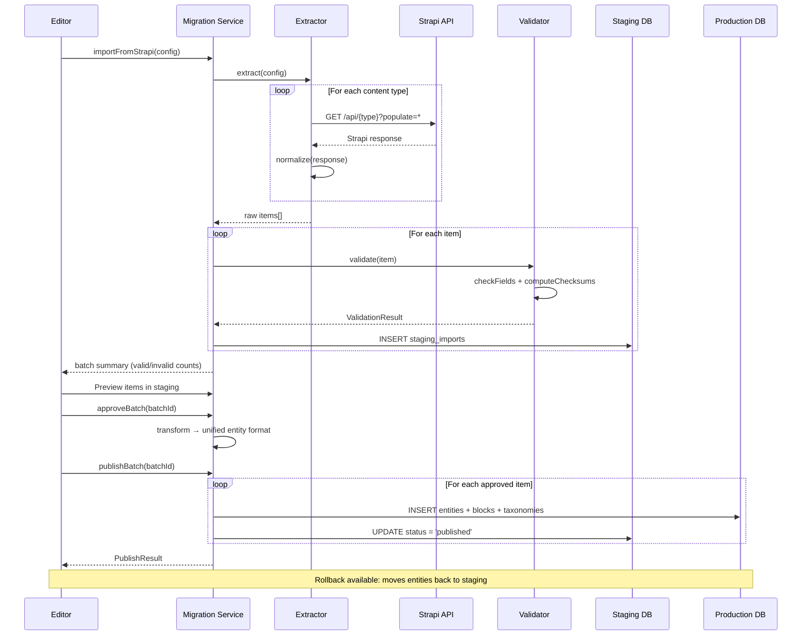
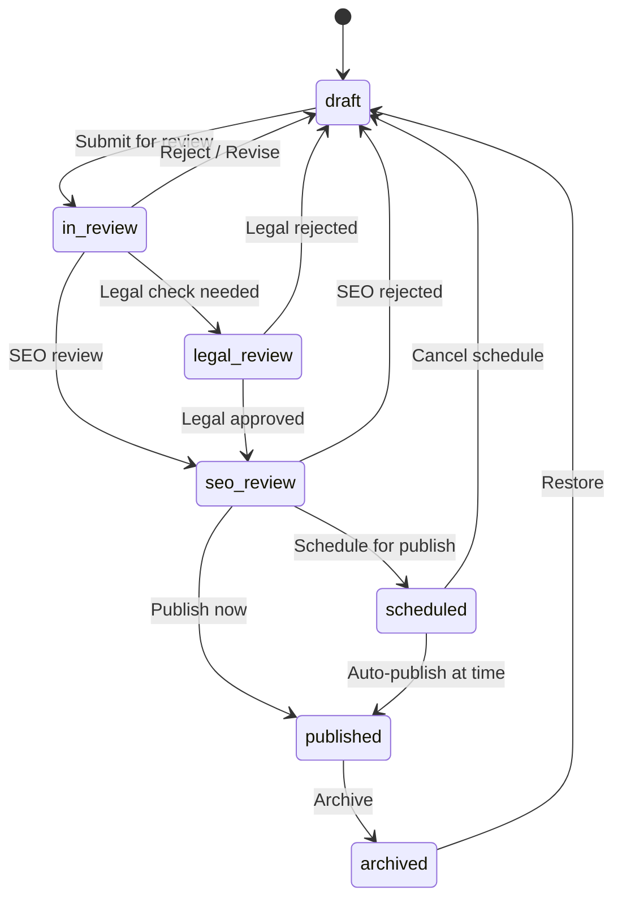
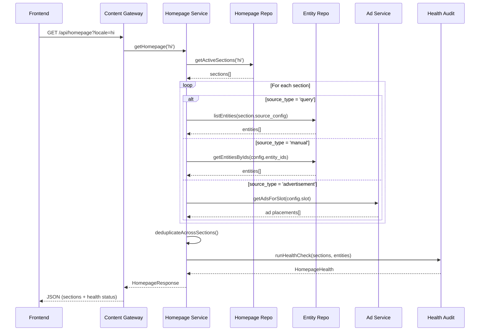

# Design Document: Rampur News Enterprise Content Platform (ECP)

## Overview

This design defines the architecture for the **Rampur News Enterprise Content Platform** — a single, unified CMS that completely replaces Strapi and becomes the only source of truth for all content operations. This is not a migration document; it is the blueprint for a production-grade content platform purpose-built for Rampur News.

The platform consolidates News, Blog, Editorial, Microsite, Education, Directory, Advertisement, Homepage Builder, Menu Manager, SEO, AI assistance, and Health Diagnostics into a single unified entity model. Strapi exists only as a one-time historical content source. After import, there is zero runtime dependency on Strapi.

The core philosophy: **everything is a Content Entity**. Articles, restaurants, institutions, events, microsites — they all share common infrastructure (slug, SEO, versioning, workflow, timestamps, authorship, media) while supporting type-specific schemas via structured JSONB metadata and modular content blocks.

The architecture introduces a **Content Gateway** pattern between the Next.js frontend and the database. The frontend never queries tables directly — it consumes stable API contracts that remain unchanged even as the underlying schema evolves. AI is a shared platform service available throughout the editorial experience. Health diagnostics provide operational visibility into content quality, SEO completeness, media integrity, and system performance.

The existing Supabase tables (migrations 010, 011) are preserved during transition via feature flags, then retired once the unified model is validated in production.

## Architecture

### System-Level Architecture

```mermaid
graph TD
    subgraph Frontend["Frontend (Next.js 15)"]
        FE[Next.js App Router]
        ISR[ISR / SSG Pages]
    end

    subgraph Gateway["Content Gateway (API Layer)"]
        CG[Content Gateway Router]
        CA[Content API]
        SA[Search API]
        HA[Homepage API]
        MA[Menu API]
        SEO[SEO API]
        WA[Widget API]
        DA[Directory API]
        AA[Advertisement API]
        MSA[Microsite API]
    end

    subgraph Services["Service Layer"]
        CS[Content Service]
        SS[Search Service]
        HS[Homepage Service]
        NS[Navigation Service]
        ADS[Ad Service]
        DS[Directory Service]
        MS[Microsite Service]
        WFS[Workflow Service]
        VS[Versioning Service]
        MIG[Migration Service]
        FFS[Feature Flag Service]
        AI[AI Service]
        DIAG[Diagnostics Service]
        VAL_S[Validation Service]
    end

    subgraph Repositories["Repository Layer"]
        ER[Entity Repository]
        BR[Block Repository]
        TR[Taxonomy Repository]
        MR[Media Repository]
        NR[Navigation Repository]
        HR[Homepage Repository]
        AR[Ad Repository]
    end

    subgraph Database["Supabase PostgreSQL"]
        ENT[entities]
        BLK[entity_blocks]
        VER[entity_versions]
        TAX[taxonomies]
        MED[media_assets]
        NAV[navigations]
        HP[homepage_sections]
        ADS_T[ad_campaigns]
        FF[feature_flags]
        RED[redirects]
        STG[staging_imports]
    end

    FE --> CG
    ISR --> CG
    CG --> CA & SA & HA & MA & SEO & WA & DA & AA & MSA
    CA --> CS
    SA --> SS
    HA --> HS
    MA --> NS
    AA --> ADS
    DA --> DS
    MSA --> MS
    CS --> WFS & VS
    CS --> ER & BR & TR & MR
    HS --> HR
    NS --> NR
    ADS --> AR
    ER --> ENT & BLK & VER
    TR --> TAX
    MR --> MED
    HR --> HP
    AR --> ADS_T
    NR --> NAV

```



### Migration Pipeline Architecture



## Unified Entity Model

### Core Principle

Instead of separate tables for articles, editorials, events, institutions, restaurants, etc., we design a **single entity table** with content type as configuration. Every entity shares: slug, SEO, versioning, workflow status, timestamps, locale, and authorship. Type-specific data lives in structured JSONB fields and modular content blocks.

### Entity Type Hierarchy

```mermaid
graph TD
    BE[Base Entity] --> ART[article]
    BE --> EDIT[editorial]
    BE --> BLOG[blog]
    BE --> EVENT[event]
    BE --> DIR[directory_listing]
    BE --> EDU[education]
    BE --> PAGE[page]
    BE --> MICRO[microsite]
    
    ART --> NEWS[news]
    ART --> OPINION[opinion]
    ART --> SPECIAL[special_report]
    ART --> LIVE[live_coverage]
    ART --> PHOTO[photo_story]
    
    BLOG --> FOOD[food_lifestyle]
    BLOG --> TRAVEL[travel]
    BLOG --> FASHION[fashion]
    BLOG --> HEALTH_B[health]
    
    DIR --> REST[restaurant]
    DIR --> INST[institution]
    DIR --> PLACE[place]
    DIR --> HOSP[hospital]
    DIR --> BUS[business]
    DIR --> GOV[government_office]
    DIR --> NGO[ngo]
    
    EDU --> EXAM[exam]
    EDU --> RESULT[result]
    EDU --> EDU_NEWS[education_news]
    EDU --> HOLIDAY[holiday]
```



## Data Models

### Core Entity Table

```sql
CREATE TABLE entities (
  id UUID PRIMARY KEY DEFAULT gen_random_uuid(),
  
  -- Identity
  slug TEXT NOT NULL,
  content_type TEXT NOT NULL,  -- 'article','editorial','blog','event','directory_listing','exam','result','education_news','holiday','page','microsite'
  sub_type TEXT,               -- article: 'news','opinion','special_report','live_coverage','photo_story' | blog: 'food_lifestyle','travel','fashion','health' | directory: 'restaurant','institution','place','hospital','business','government_office','ngo'
  
  -- Multilingual content
  title JSONB NOT NULL DEFAULT '{}',        -- {"hi": "...", "en": "...", "ur": "..."}
  excerpt JSONB DEFAULT '{}',               -- {"hi": "...", "en": "..."}
  body JSONB DEFAULT '{}',                  -- {"hi": "...", "en": "..."} (rich text)
  
  -- Relationships
  author_id UUID REFERENCES authors(id),
  primary_category_id UUID REFERENCES taxonomies(id),
  featured_media_id UUID REFERENCES media_assets(id),
  parent_entity_id UUID REFERENCES entities(id),  -- for microsite children, editorial collections
  
  -- SEO (multilingual)
  seo JSONB DEFAULT '{}',  -- {title, description, keywords[], og_title, og_description, canonical_url, schema_json}
  
  -- Type-specific structured data
  metadata JSONB DEFAULT '{}',  -- type-specific fields (location, dates, ratings, contact, etc.)
  
  -- Editorial workflow
  status TEXT NOT NULL DEFAULT 'draft'
    CHECK (status IN ('draft','in_review','legal_review','seo_review','scheduled','published','archived')),
  workflow_notes TEXT,
  
  -- Feature flags & priority
  is_breaking BOOLEAN DEFAULT false,
  is_featured BOOLEAN DEFAULT false,
  is_editors_pick BOOLEAN DEFAULT false,
  priority INT DEFAULT 0,
  
  -- Scheduling
  published_at TIMESTAMPTZ,
  scheduled_at TIMESTAMPTZ,
  expires_at TIMESTAMPTZ,
  
  -- Metrics
  views BIGINT DEFAULT 0,
  shares INT DEFAULT 0,
  read_time_minutes INT,
  word_count INT,
  
  -- Versioning
  current_version INT DEFAULT 1,
  
  -- Locale
  primary_locale TEXT DEFAULT 'hi',
  available_locales TEXT[] DEFAULT ARRAY['hi'],
  
  -- Audit
  created_by UUID,
  updated_by UUID,
  created_at TIMESTAMPTZ NOT NULL DEFAULT NOW(),
  updated_at TIMESTAMPTZ NOT NULL DEFAULT NOW(),
  
  -- Constraints
  UNIQUE(slug, content_type)
);

-- Indexes
CREATE INDEX idx_entities_slug ON entities(slug);
CREATE INDEX idx_entities_type ON entities(content_type);
CREATE INDEX idx_entities_subtype ON entities(sub_type) WHERE sub_type IS NOT NULL;
CREATE INDEX idx_entities_status ON entities(status);
CREATE INDEX idx_entities_published ON entities(published_at DESC) WHERE status = 'published';
CREATE INDEX idx_entities_featured ON entities(is_featured) WHERE is_featured = true;
CREATE INDEX idx_entities_breaking ON entities(is_breaking) WHERE is_breaking = true;
CREATE INDEX idx_entities_category ON entities(primary_category_id);
CREATE INDEX idx_entities_author ON entities(author_id);
CREATE INDEX idx_entities_parent ON entities(parent_entity_id) WHERE parent_entity_id IS NOT NULL;
CREATE INDEX idx_entities_scheduled ON entities(scheduled_at) WHERE scheduled_at IS NOT NULL;
CREATE INDEX idx_entities_locale ON entities USING GIN(available_locales);
CREATE INDEX idx_entities_metadata ON entities USING GIN(metadata jsonb_path_ops);
```

### Content Blocks Table

```sql
CREATE TABLE entity_blocks (
  id UUID PRIMARY KEY DEFAULT gen_random_uuid(),
  entity_id UUID NOT NULL REFERENCES entities(id) ON DELETE CASCADE,
  
  -- Block identity
  block_type TEXT NOT NULL,  -- 'hero','gallery','faq','timeline','video','quote','table','chart','map','related_articles','poll','embed','advertisement','rich_text','image','code','callout'
  
  -- Position & grouping
  position INT NOT NULL DEFAULT 0,
  section TEXT DEFAULT 'body',  -- 'body','sidebar','footer','header'
  
  -- Block content (flexible per type)
  content JSONB NOT NULL DEFAULT '{}',
  
  -- Multilingual block content
  locale TEXT DEFAULT 'hi',
  
  -- Visibility
  is_visible BOOLEAN DEFAULT true,
  visible_from TIMESTAMPTZ,
  visible_until TIMESTAMPTZ,
  
  -- Device targeting
  device_visibility TEXT DEFAULT 'all' CHECK (device_visibility IN ('all','mobile','desktop')),
  
  created_at TIMESTAMPTZ NOT NULL DEFAULT NOW(),
  updated_at TIMESTAMPTZ NOT NULL DEFAULT NOW()
);

CREATE INDEX idx_entity_blocks_entity ON entity_blocks(entity_id);
CREATE INDEX idx_entity_blocks_type ON entity_blocks(block_type);
CREATE INDEX idx_entity_blocks_position ON entity_blocks(entity_id, position);
```

### Entity Versions Table

```sql
CREATE TABLE entity_versions (
  id UUID PRIMARY KEY DEFAULT gen_random_uuid(),
  entity_id UUID NOT NULL REFERENCES entities(id) ON DELETE CASCADE,
  version_number INT NOT NULL,
  
  -- Full snapshot
  snapshot JSONB NOT NULL,  -- complete entity state + blocks at this version
  blocks_snapshot JSONB DEFAULT '[]',
  
  -- Metadata
  change_summary TEXT,
  status_at_version TEXT,
  
  -- Audit
  created_by UUID,
  created_at TIMESTAMPTZ NOT NULL DEFAULT NOW(),
  
  UNIQUE(entity_id, version_number)
);

CREATE INDEX idx_entity_versions_entity ON entity_versions(entity_id);
CREATE INDEX idx_entity_versions_number ON entity_versions(entity_id, version_number DESC);
```

### Taxonomy System

```sql
CREATE TABLE taxonomies (
  id UUID PRIMARY KEY DEFAULT gen_random_uuid(),
  taxonomy_type TEXT NOT NULL,  -- 'category','tag','collection','topic','location'
  slug TEXT NOT NULL,
  
  -- Multilingual
  title JSONB NOT NULL DEFAULT '{}',  -- {"hi": "...", "en": "..."}
  description JSONB DEFAULT '{}',
  
  -- Hierarchy
  parent_id UUID REFERENCES taxonomies(id) ON DELETE SET NULL,
  path TEXT,  -- materialized path: 'news/local/rampur'
  depth INT DEFAULT 0,
  
  -- SEO
  seo JSONB DEFAULT '{}',
  
  -- Config
  "order" INT DEFAULT 0,
  is_active BOOLEAN DEFAULT true,
  icon TEXT,
  color TEXT,
  
  -- Scoring (for tags)
  score INT DEFAULT 50,
  entity_count INT DEFAULT 0,
  noindex BOOLEAN DEFAULT false,
  canonical_id UUID REFERENCES taxonomies(id),
  
  created_at TIMESTAMPTZ NOT NULL DEFAULT NOW(),
  updated_at TIMESTAMPTZ NOT NULL DEFAULT NOW(),
  
  UNIQUE(taxonomy_type, slug)
);

CREATE INDEX idx_taxonomies_type ON taxonomies(taxonomy_type);
CREATE INDEX idx_taxonomies_slug ON taxonomies(slug);
CREATE INDEX idx_taxonomies_parent ON taxonomies(parent_id);
CREATE INDEX idx_taxonomies_path ON taxonomies(path);
```

### Entity-Taxonomy Junction

```sql
CREATE TABLE entity_taxonomies (
  entity_id UUID NOT NULL REFERENCES entities(id) ON DELETE CASCADE,
  taxonomy_id UUID NOT NULL REFERENCES taxonomies(id) ON DELETE CASCADE,
  is_primary BOOLEAN DEFAULT false,
  "order" INT DEFAULT 0,
  PRIMARY KEY (entity_id, taxonomy_id)
);

CREATE INDEX idx_entity_taxonomies_taxonomy ON entity_taxonomies(taxonomy_id);
CREATE INDEX idx_entity_taxonomies_primary ON entity_taxonomies(entity_id) WHERE is_primary = true;
```

### Media Assets (with Deduplication)

```sql
CREATE TABLE media_assets (
  id UUID PRIMARY KEY DEFAULT gen_random_uuid(),
  
  -- File identity
  filename TEXT NOT NULL,
  original_filename TEXT NOT NULL,
  mime_type TEXT NOT NULL,
  size_bytes BIGINT NOT NULL,
  
  -- Dimensions (images/video)
  width INT,
  height INT,
  duration_seconds INT,  -- for video/audio
  
  -- Content hash for deduplication
  content_hash TEXT NOT NULL,  -- SHA-256 of file content
  
  -- Multilingual metadata
  alt_text JSONB DEFAULT '{}',   -- {"hi": "...", "en": "..."}
  caption JSONB DEFAULT '{}',
  
  -- Storage
  storage_path TEXT NOT NULL,
  storage_bucket TEXT DEFAULT 'cms-media',
  url TEXT NOT NULL,
  
  -- Variants (responsive images)
  variants JSONB DEFAULT '{}',  -- {"thumb": "url", "medium": "url", "large": "url"}
  variant_status TEXT DEFAULT 'pending' CHECK (variant_status IN ('pending','processing','completed','failed')),
  
  -- Source tracking (for migration)
  source_system TEXT,  -- 'strapi', 'upload', 'import'
  source_url TEXT,     -- original URL if imported
  
  -- Usage tracking
  reference_count INT DEFAULT 0,
  
  -- Audit
  uploaded_by UUID,
  created_at TIMESTAMPTZ NOT NULL DEFAULT NOW(),
  updated_at TIMESTAMPTZ NOT NULL DEFAULT NOW(),
  
  UNIQUE(content_hash, storage_bucket)
);

CREATE INDEX idx_media_hash ON media_assets(content_hash);
CREATE INDEX idx_media_mime ON media_assets(mime_type);
CREATE INDEX idx_media_source ON media_assets(source_system) WHERE source_system IS NOT NULL;
```

### Authors Table

```sql
CREATE TABLE authors (
  id UUID PRIMARY KEY DEFAULT gen_random_uuid(),
  slug TEXT NOT NULL UNIQUE,
  
  -- Multilingual
  name JSONB NOT NULL DEFAULT '{}',  -- {"hi": "...", "en": "..."}
  bio JSONB DEFAULT '{}',
  designation JSONB DEFAULT '{}',
  
  -- Contact & social
  email TEXT UNIQUE,
  avatar_id UUID REFERENCES media_assets(id),
  social_links JSONB DEFAULT '{}',  -- {twitter, linkedin, facebook, instagram, whatsapp, website}
  
  -- Expertise
  expertise TEXT[],
  
  -- Role & permissions
  role TEXT DEFAULT 'author' CHECK (role IN ('admin','editor','senior_editor','author','contributor','guest')),
  is_active BOOLEAN DEFAULT true,
  
  -- Metrics
  article_count INT DEFAULT 0,
  
  created_at TIMESTAMPTZ NOT NULL DEFAULT NOW(),
  updated_at TIMESTAMPTZ NOT NULL DEFAULT NOW()
);
```

## Homepage Builder

### Homepage Sections Table

```sql
CREATE TABLE homepage_sections (
  id UUID PRIMARY KEY DEFAULT gen_random_uuid(),
  
  -- Identity
  slug TEXT NOT NULL UNIQUE,
  title JSONB NOT NULL DEFAULT '{}',  -- {"hi": "...", "en": "..."}
  
  -- Layout
  template TEXT NOT NULL,  -- 'hero','featured','grid','compact_list','two_columns','timeline','editorial_picks','widget','ad_slot'
  position INT NOT NULL DEFAULT 0,
  
  -- Content source
  source_type TEXT NOT NULL,  -- 'query','manual','widget','advertisement'
  source_config JSONB NOT NULL DEFAULT '{}',
  -- For query: {content_type, category_slug, tags[], limit, sort, filters}
  -- For manual: {entity_ids: [...]}
  -- For widget: {widget_type, config}
  -- For ad: {campaign_id, placement}
  
  -- Visibility & scheduling
  is_active BOOLEAN DEFAULT true,
  visible_from TIMESTAMPTZ,
  visible_until TIMESTAMPTZ,
  device_visibility TEXT DEFAULT 'all' CHECK (device_visibility IN ('all','mobile','desktop')),
  
  -- Display config
  max_items INT DEFAULT 5,
  show_ad_after BOOLEAN DEFAULT false,
  css_class TEXT,
  
  -- Priority & localization
  priority INT DEFAULT 0,
  locale TEXT DEFAULT 'hi',
  
  created_at TIMESTAMPTZ NOT NULL DEFAULT NOW(),
  updated_at TIMESTAMPTZ NOT NULL DEFAULT NOW()
);

CREATE INDEX idx_homepage_sections_position ON homepage_sections(position);
CREATE INDEX idx_homepage_sections_active ON homepage_sections(is_active) WHERE is_active = true;
```

### Homepage Health Audit Table

```sql
CREATE TABLE homepage_audits (
  id UUID PRIMARY KEY DEFAULT gen_random_uuid(),
  
  audit_type TEXT NOT NULL,  -- 'broken_section','missing_image','broken_ad','missing_seo','empty_section','slow_query'
  section_id UUID REFERENCES homepage_sections(id) ON DELETE SET NULL,
  entity_id UUID REFERENCES entities(id) ON DELETE SET NULL,
  
  severity TEXT NOT NULL CHECK (severity IN ('critical','warning','info')),
  message TEXT NOT NULL,
  details JSONB DEFAULT '{}',
  
  -- Resolution
  is_resolved BOOLEAN DEFAULT false,
  resolved_by UUID,
  resolved_at TIMESTAMPTZ,
  
  created_at TIMESTAMPTZ NOT NULL DEFAULT NOW()
);

CREATE INDEX idx_homepage_audits_unresolved ON homepage_audits(is_resolved) WHERE is_resolved = false;
CREATE INDEX idx_homepage_audits_section ON homepage_audits(section_id);
```

## Navigation System

```sql
CREATE TABLE navigations (
  id UUID PRIMARY KEY DEFAULT gen_random_uuid(),
  
  -- Identity
  slug TEXT NOT NULL UNIQUE,  -- 'header','footer','sidebar','mobile','breadcrumb','quick_links'
  title JSONB NOT NULL DEFAULT '{}',
  nav_type TEXT NOT NULL,  -- 'header','footer','sidebar','mobile','breadcrumb','quick_links','contextual'
  
  -- Configuration
  is_active BOOLEAN DEFAULT true,
  locale TEXT DEFAULT 'hi',
  
  created_at TIMESTAMPTZ NOT NULL DEFAULT NOW(),
  updated_at TIMESTAMPTZ NOT NULL DEFAULT NOW()
);

CREATE TABLE navigation_items (
  id UUID PRIMARY KEY DEFAULT gen_random_uuid(),
  navigation_id UUID NOT NULL REFERENCES navigations(id) ON DELETE CASCADE,
  parent_item_id UUID REFERENCES navigation_items(id) ON DELETE CASCADE,
  
  -- Content
  label JSONB NOT NULL DEFAULT '{}',  -- {"hi": "...", "en": "..."}
  url TEXT,
  icon TEXT,
  
  -- Linking
  entity_id UUID REFERENCES entities(id) ON DELETE SET NULL,
  taxonomy_id UUID REFERENCES taxonomies(id) ON DELETE SET NULL,
  
  -- Position
  position INT NOT NULL DEFAULT 0,
  depth INT DEFAULT 0,
  
  -- Visibility
  is_active BOOLEAN DEFAULT true,
  open_in_new_tab BOOLEAN DEFAULT false,
  device_visibility TEXT DEFAULT 'all',
  
  -- Highlight/badge
  badge_text TEXT,
  badge_color TEXT,
  
  created_at TIMESTAMPTZ NOT NULL DEFAULT NOW(),
  updated_at TIMESTAMPTZ NOT NULL DEFAULT NOW()
);

CREATE INDEX idx_nav_items_nav ON navigation_items(navigation_id);
CREATE INDEX idx_nav_items_parent ON navigation_items(parent_item_id);
CREATE INDEX idx_nav_items_position ON navigation_items(navigation_id, position);
```

## Advertisement Engine

```sql
CREATE TABLE ad_campaigns (
  id UUID PRIMARY KEY DEFAULT gen_random_uuid(),
  
  -- Identity
  name TEXT NOT NULL,
  slug TEXT NOT NULL UNIQUE,
  advertiser TEXT,
  
  -- Schedule
  start_date TIMESTAMPTZ NOT NULL,
  end_date TIMESTAMPTZ,
  is_active BOOLEAN DEFAULT true,
  
  -- Budget & targeting
  budget_type TEXT CHECK (budget_type IN ('unlimited','impressions','clicks','days')),
  budget_limit INT,
  target_categories TEXT[],
  target_locales TEXT[],
  
  -- Metrics
  total_impressions BIGINT DEFAULT 0,
  total_clicks BIGINT DEFAULT 0,
  
  created_at TIMESTAMPTZ NOT NULL DEFAULT NOW(),
  updated_at TIMESTAMPTZ NOT NULL DEFAULT NOW()
);

CREATE TABLE ad_placements (
  id UUID PRIMARY KEY DEFAULT gen_random_uuid(),
  campaign_id UUID NOT NULL REFERENCES ad_campaigns(id) ON DELETE CASCADE,
  
  -- Placement
  slot TEXT NOT NULL,  -- 'header','sidebar','infeed','article_top','article_middle','article_bottom','footer','mobile_sticky','homepage_section'
  
  -- Creative
  ad_type TEXT NOT NULL CHECK (ad_type IN ('adsense','image','html','video')),
  creative JSONB NOT NULL DEFAULT '{}',  -- {code, image_url, target_url, video_url, html}
  
  -- Targeting
  device_type TEXT DEFAULT 'all' CHECK (device_type IN ('all','mobile','desktop')),
  priority INT DEFAULT 0,
  weight INT DEFAULT 100,
  
  -- Schedule override
  visible_from TIMESTAMPTZ,
  visible_until TIMESTAMPTZ,
  
  -- Metrics
  impressions BIGINT DEFAULT 0,
  clicks BIGINT DEFAULT 0,
  
  created_at TIMESTAMPTZ NOT NULL DEFAULT NOW(),
  updated_at TIMESTAMPTZ NOT NULL DEFAULT NOW()
);

CREATE INDEX idx_ad_placements_campaign ON ad_placements(campaign_id);
CREATE INDEX idx_ad_placements_slot ON ad_placements(slot);
CREATE INDEX idx_ad_placements_active ON ad_placements(campaign_id, slot) 
  WHERE visible_from IS NULL OR visible_from <= NOW();
```

## Feature Flags

```sql
CREATE TABLE feature_flags (
  id UUID PRIMARY KEY DEFAULT gen_random_uuid(),
  key TEXT NOT NULL UNIQUE,  -- 'USE_CUSTOM_CMS','USE_HOMEPAGE_BUILDER','USE_NEW_SEARCH','USE_NEW_ADS','USE_NEW_DIRECTORY','USE_UNIFIED_ENTITY'
  
  -- Configuration
  is_enabled BOOLEAN DEFAULT false,
  rollout_percentage INT DEFAULT 0 CHECK (rollout_percentage >= 0 AND rollout_percentage <= 100),
  
  -- Targeting
  allowed_users UUID[],
  allowed_roles TEXT[],
  
  -- Metadata
  description TEXT,
  category TEXT,  -- 'migration','feature','experiment'
  
  created_at TIMESTAMPTZ NOT NULL DEFAULT NOW(),
  updated_at TIMESTAMPTZ NOT NULL DEFAULT NOW()
);
```

## Migration & Import System

### Staging Tables

```sql
CREATE TABLE staging_imports (
  id UUID PRIMARY KEY DEFAULT gen_random_uuid(),
  
  -- Source identification
  batch_id UUID NOT NULL,
  source_system TEXT NOT NULL,  -- 'strapi','legacy_cms'
  source_id TEXT NOT NULL,      -- original ID in source system
  source_type TEXT NOT NULL,    -- 'article','category','media','tag','author'
  
  -- Raw data
  raw_payload JSONB NOT NULL,
  
  -- Transformed data
  transformed_payload JSONB,
  target_content_type TEXT,
  target_entity_id UUID,  -- set after publish
  
  -- Validation
  validation_status TEXT DEFAULT 'pending' 
    CHECK (validation_status IN ('pending','valid','invalid','warning')),
  validation_errors JSONB DEFAULT '[]',
  validation_warnings JSONB DEFAULT '[]',
  
  -- Checksums for integrity
  checksums JSONB DEFAULT '{}',  -- {title_hash, body_hash, media_hash, full_hash}
  
  -- State
  import_status TEXT DEFAULT 'staged'
    CHECK (import_status IN ('staged','validated','approved','published','rejected','rolled_back')),
  
  -- Audit
  imported_by UUID,
  approved_by UUID,
  published_at TIMESTAMPTZ,
  rolled_back_at TIMESTAMPTZ,
  
  created_at TIMESTAMPTZ NOT NULL DEFAULT NOW(),
  updated_at TIMESTAMPTZ NOT NULL DEFAULT NOW()
);

CREATE INDEX idx_staging_batch ON staging_imports(batch_id);
CREATE INDEX idx_staging_source ON staging_imports(source_system, source_id);
CREATE INDEX idx_staging_status ON staging_imports(import_status);
CREATE INDEX idx_staging_validation ON staging_imports(validation_status);

CREATE TABLE migration_batches (
  id UUID PRIMARY KEY DEFAULT gen_random_uuid(),
  
  -- Batch info
  name TEXT NOT NULL,
  source_system TEXT NOT NULL,
  
  -- Progress
  total_items INT DEFAULT 0,
  processed_items INT DEFAULT 0,
  valid_items INT DEFAULT 0,
  invalid_items INT DEFAULT 0,
  published_items INT DEFAULT 0,
  
  -- State
  status TEXT DEFAULT 'in_progress'
    CHECK (status IN ('in_progress','validated','partially_approved','fully_approved','published','rolled_back')),
  
  -- Audit
  started_by UUID,
  completed_at TIMESTAMPTZ,
  
  created_at TIMESTAMPTZ NOT NULL DEFAULT NOW(),
  updated_at TIMESTAMPTZ NOT NULL DEFAULT NOW()
);
```

## Unified Search Architecture

```sql
-- Full-text search view combining all published entities
CREATE MATERIALIZED VIEW search_index AS
SELECT 
  e.id,
  e.slug,
  e.content_type,
  e.sub_type,
  e.title->>'hi' AS title_hi,
  e.title->>'en' AS title_en,
  e.excerpt->>'hi' AS excerpt_hi,
  e.body->>'hi' AS body_hi,
  e.status,
  e.published_at,
  e.is_featured,
  e.is_breaking,
  e.primary_category_id,
  e.author_id,
  e.metadata,
  -- Full text search vector
  to_tsvector('simple', COALESCE(e.title->>'hi','') || ' ' || 
    COALESCE(e.title->>'en','') || ' ' || 
    COALESCE(e.excerpt->>'hi','') || ' ' ||
    COALESCE(e.body->>'hi',''))
  AS search_vector
FROM entities e
WHERE e.status = 'published';

CREATE INDEX idx_search_vector ON search_index USING GIN(search_vector);
CREATE INDEX idx_search_type ON search_index(content_type);
CREATE INDEX idx_search_published ON search_index(published_at DESC);
CREATE UNIQUE INDEX idx_search_id ON search_index(id);
```

## Components and Interfaces

### Content Gateway (TypeScript)

```typescript
// Content Gateway — the ONLY interface the frontend talks to

interface ContentGateway {
  // Content API
  getEntity(slug: string, type?: string): Promise<EntityResponse>
  listEntities(query: EntityQuery): Promise<PaginatedResponse<EntitySummary>>
  
  // Search API
  search(query: SearchQuery): Promise<SearchResponse>
  
  // Homepage API
  getHomepage(locale?: string): Promise<HomepageResponse>
  
  // Menu API
  getNavigation(slug: string, locale?: string): Promise<NavigationResponse>
  
  // SEO API
  getSitemap(type?: string): Promise<SitemapEntry[]>
  getStructuredData(slug: string): Promise<JsonLd>
  
  // Widget API
  getWidget(type: string, config: Record<string, unknown>): Promise<WidgetResponse>
  
  // Directory API
  getDirectoryListing(query: DirectoryQuery): Promise<PaginatedResponse<DirectoryEntry>>
  getDirectoryEntry(slug: string): Promise<DirectoryEntry>
  
  // Advertisement API
  getAdsForSlot(slot: string, context?: AdContext): Promise<AdPlacement[]>
  trackImpression(placementId: string): Promise<void>
  trackClick(placementId: string): Promise<void>
  
  // Microsite API
  getMicrosite(slug: string): Promise<MicrositeResponse>
}

interface EntityQuery {
  content_type?: string | string[]
  sub_type?: string
  category?: string
  tags?: string[]
  author?: string
  locale?: string
  status?: string
  is_featured?: boolean
  is_breaking?: boolean
  search?: string
  sort?: 'published_at' | 'views' | 'priority' | 'created_at'
  order?: 'asc' | 'desc'
  page?: number
  page_size?: number
  parent_id?: string  // for microsite children
}

interface EntityResponse {
  entity: Entity
  blocks: ContentBlock[]
  related: EntitySummary[]
  breadcrumb: BreadcrumbItem[]
  seo: SeoData
}

interface Entity {
  id: string
  slug: string
  content_type: string
  sub_type?: string
  title: LocalizedField
  excerpt: LocalizedField
  body: LocalizedField
  author: AuthorSummary
  primary_category: TaxonomySummary
  categories: TaxonomySummary[]
  tags: TaxonomySummary[]
  featured_media: MediaAsset | null
  seo: SeoData
  metadata: Record<string, unknown>
  status: string
  is_breaking: boolean
  is_featured: boolean
  is_editors_pick: boolean
  priority: number
  published_at: string | null
  read_time_minutes: number | null
  word_count: number | null
  views: number
  current_version: number
  primary_locale: string
  available_locales: string[]
  created_at: string
  updated_at: string
}

interface ContentBlock {
  id: string
  block_type: string  // 'hero'|'gallery'|'faq'|'timeline'|'video'|'quote'|'table'|'chart'|'map'|'related_articles'|'poll'|'embed'|'advertisement'|'rich_text'|'image'|'code'|'callout'
  position: number
  section: string
  content: Record<string, unknown>
  locale: string
  is_visible: boolean
  device_visibility: string
}

type LocalizedField = Record<string, string>  // { hi: "...", en: "...", ur: "..." }

interface SearchQuery {
  q: string
  content_types?: string[]
  category?: string
  locale?: string
  from_date?: string
  to_date?: string
  page?: number
  page_size?: number
}

interface SearchResponse {
  results: SearchResult[]
  total: number
  facets: {
    content_types: { type: string; count: number }[]
    categories: { slug: string; title: string; count: number }[]
  }
  page: number
  page_size: number
}

interface HomepageResponse {
  sections: HomepageSection[]
  health: HomepageHealth
  last_updated: string
}

interface HomepageSection {
  id: string
  slug: string
  title: LocalizedField
  template: string
  items: EntitySummary[]
  ad_placement?: AdPlacement
  is_active: boolean
  device_visibility: string
}

interface HomepageHealth {
  status: 'healthy' | 'degraded' | 'critical'
  warnings: HealthWarning[]
  broken_sections: string[]
  missing_images: number
  broken_ads: number
}
```

### Directory Framework Interface

```typescript
// Unified Directory — restaurants, institutions, hospitals, businesses all use this
interface DirectoryQuery {
  sub_type?: string  // 'restaurant','institution','place','hospital','business'
  city?: string
  district?: string
  category?: string
  rating_min?: number
  is_verified?: boolean
  is_featured?: boolean
  sort?: 'rating' | 'name' | 'created_at' | 'distance'
  latitude?: number
  longitude?: number
  radius_km?: number
  page?: number
  page_size?: number
}

interface DirectoryEntry {
  entity: Entity
  // Extracted from entity.metadata for convenience:
  address: Address
  contact: ContactInfo
  rating: number | null
  review_count: number
  operating_hours: OperatingHours | null
  features: string[]
  gallery: MediaAsset[]
  is_verified: boolean
}

interface Address {
  street: LocalizedField
  city: string
  district: string
  state: string
  pincode: string
  latitude: number | null
  longitude: number | null
}

interface MicrositeResponse {
  entity: Entity  // The microsite parent entity
  landing_page: ContentBlock[]
  children: EntitySummary[]  // Articles/content within this microsite
  navigation: NavigationItem[]
  seo: SeoData
}
```

### Migration Service Interface

```typescript
interface MigrationService {
  // Import from Strapi
  importFromStrapi(config: ImportConfig): Promise<MigrationBatch>
  
  // Import from existing CMS tables
  importFromLegacyTables(config: LegacyImportConfig): Promise<MigrationBatch>
  
  // Validation
  validateBatch(batchId: string): Promise<ValidationReport>
  validateSingleImport(importId: string): Promise<ValidationResult>
  
  // Comparison (automated diff)
  compareImport(importId: string): Promise<ComparisonReport>
  
  // Approval workflow
  approveImport(importId: string, userId: string): Promise<void>
  rejectImport(importId: string, reason: string): Promise<void>
  approveBatch(batchId: string, userId: string): Promise<void>
  
  // Publish
  publishBatch(batchId: string): Promise<PublishResult>
  publishImport(importId: string): Promise<PublishResult>
  
  // Rollback
  rollbackBatch(batchId: string): Promise<RollbackResult>
  rollbackImport(importId: string): Promise<RollbackResult>
}

interface ImportConfig {
  source_url: string
  api_token?: string
  content_types: string[]  // ['articles', 'categories', 'authors', 'tags', 'media']
  filters?: {
    published_only?: boolean
    since_date?: string
    category_slugs?: string[]
  }
}

interface ValidationResult {
  is_valid: boolean
  errors: ValidationIssue[]
  warnings: ValidationIssue[]
  comparison: {
    title_match: boolean
    slug_match: boolean
    author_match: boolean
    seo_present: boolean
    media_accessible: boolean
    body_word_count: { source: number; transformed: number }
    body_checksum: { source: string; transformed: string; matches: boolean }
    tags_match: boolean
    categories_match: boolean
    publish_date_match: boolean
  }
}

interface ValidationIssue {
  field: string
  code: string  // 'MISSING_REQUIRED','INVALID_FORMAT','MEDIA_404','CHECKSUM_MISMATCH','SLUG_COLLISION'
  message: string
  severity: 'error' | 'warning'
  source_value?: unknown
  transformed_value?: unknown
}

interface RollbackResult {
  success: boolean
  rolled_back_count: number
  errors: string[]
  // Entities are moved back to staging, not deleted
}
```

### Editorial Workflow Service

```typescript
type WorkflowStatus = 'draft' | 'in_review' | 'legal_review' | 'seo_review' | 'scheduled' | 'published' | 'archived'

interface WorkflowService {
  transition(entityId: string, targetStatus: WorkflowStatus, userId: string, notes?: string): Promise<TransitionResult>
  getValidTransitions(currentStatus: WorkflowStatus, userRole: string): WorkflowStatus[]
  getWorkflowHistory(entityId: string): Promise<WorkflowEvent[]>
  schedulePublish(entityId: string, publishAt: Date, userId: string): Promise<void>
  bulkTransition(entityIds: string[], targetStatus: WorkflowStatus, userId: string): Promise<BulkTransitionResult>
}

// State machine
const WORKFLOW_TRANSITIONS: Record<WorkflowStatus, WorkflowStatus[]> = {
  draft: ['in_review'],
  in_review: ['legal_review', 'seo_review', 'draft'],
  legal_review: ['seo_review', 'draft'],
  seo_review: ['scheduled', 'published', 'draft'],
  scheduled: ['published', 'draft'],
  published: ['archived', 'draft'],
  archived: ['draft'],
}

// Role-based gate: who can trigger which transitions
const ROLE_PERMISSIONS: Record<string, WorkflowStatus[]> = {
  contributor: ['draft', 'in_review'],
  author: ['draft', 'in_review'],
  editor: ['draft', 'in_review', 'legal_review', 'seo_review', 'scheduled'],
  senior_editor: ['draft', 'in_review', 'legal_review', 'seo_review', 'scheduled', 'published', 'archived'],
  admin: ['draft', 'in_review', 'legal_review', 'seo_review', 'scheduled', 'published', 'archived'],
}
```

### Feature Flag Service

```typescript
interface FeatureFlagService {
  isEnabled(key: string, context?: FlagContext): Promise<boolean>
  getAll(): Promise<FeatureFlag[]>
  setFlag(key: string, enabled: boolean, rolloutPercentage?: number): Promise<void>
}

interface FlagContext {
  userId?: string
  userRole?: string
  locale?: string
}

// Feature flag keys for gradual migration rollout
const MIGRATION_FLAGS = {
  USE_UNIFIED_ENTITY: 'USE_UNIFIED_ENTITY',        // Read from new entity table vs legacy tables
  USE_HOMEPAGE_BUILDER: 'USE_HOMEPAGE_BUILDER',     // CMS-managed homepage vs code-defined
  USE_NEW_SEARCH: 'USE_NEW_SEARCH',                 // Unified search vs per-table queries
  USE_NEW_ADS: 'USE_NEW_ADS',                       // Campaign-based ads vs simple ads table
  USE_NEW_DIRECTORY: 'USE_NEW_DIRECTORY',           // Unified directory vs separate tables
  USE_CONTENT_GATEWAY: 'USE_CONTENT_GATEWAY',       // Gateway pattern vs direct DB queries
  USE_NEW_NAVIGATION: 'USE_NEW_NAVIGATION',         // CMS-managed nav vs hardcoded
  STRAPI_READ_ENABLED: 'STRAPI_READ_ENABLED',       // Still read from Strapi (false = fully migrated)
} as const
```

## Sequence Diagrams

### Content Retrieval via Gateway



### Migration Import Flow



### Editorial Workflow



### Homepage Builder Data Flow



## API Contracts

### Content API

```typescript
// GET /api/content/:type/:slug
// Response: EntityResponse

// GET /api/content/:type?page=1&page_size=25&category=rampur&sort=published_at&order=desc
// Response: PaginatedResponse<EntitySummary>

// GET /api/content/breaking
// Response: EntitySummary[]

// GET /api/content/featured?limit=5
// Response: EntitySummary[]
```

### Search API

```typescript
// GET /api/search?q=query&content_types=article,editorial&category=rampur&page=1
// Response: SearchResponse (with facets)

// GET /api/search/suggest?q=partial_query&limit=5
// Response: { suggestions: string[] }
```

### Homepage API

```typescript
// GET /api/homepage?locale=hi
// Response: HomepageResponse (sections + health)

// GET /api/homepage/health
// Response: HomepageHealth (audit warnings, broken sections)
```

### Menu API

```typescript
// GET /api/navigation/:slug?locale=hi
// Response: NavigationResponse { items: NavigationItem[] }

// GET /api/navigation/all
// Response: { navigations: NavigationSummary[] }
```

### SEO API

```typescript
// GET /api/seo/sitemap?type=article
// Response: SitemapEntry[] {slug, lastmod, changefreq, priority}

// GET /api/seo/structured-data/:slug
// Response: JsonLd schema

// GET /api/seo/meta/:slug
// Response: SeoData {title, description, keywords, og, canonical}
```

### Widget API

```typescript
// GET /api/widgets/:type?config=base64encodedJSON
// Response: WidgetResponse {type, data, render_hints}

// Widget types: trending, most_read, related, author_articles, tag_cloud, social_feed
```

### Directory API

```typescript
// GET /api/directory?sub_type=restaurant&city=rampur&page=1
// Response: PaginatedResponse<DirectoryEntry>

// GET /api/directory/:slug
// Response: DirectoryEntry (full details)

// GET /api/directory/nearby?lat=28.8&lng=79.0&radius=5
// Response: DirectoryEntry[]
```

### Advertisement API

```typescript
// GET /api/ads/slot/:slot?category=rampur&device=mobile
// Response: AdPlacement[]

// POST /api/ads/impression  body: { placement_id }
// Response: 204

// POST /api/ads/click  body: { placement_id }
// Response: 204

// GET /api/ads/analytics?campaign_id=xxx
// Response: CampaignAnalytics
```

### Microsite API

```typescript
// GET /api/microsites/:slug
// Response: MicrositeResponse (landing page + children + nav)

// GET /api/microsites/:slug/content?page=1
// Response: PaginatedResponse<EntitySummary>
```

## Schema Evolution Strategy

### Phase 1: Create New Tables (Non-Breaking)

New tables (`entities`, `entity_blocks`, `entity_versions`, `entity_taxonomies`, `media_assets` with dedup, `authors` new, `taxonomies`, `navigations`, `navigation_items`, `homepage_sections`, `homepage_audits`, `ad_campaigns`, `ad_placements`, `feature_flags`, `staging_imports`, `migration_batches`) are created alongside existing tables. No existing table is dropped or altered.

### Phase 2: Dual-Write Period

When `USE_UNIFIED_ENTITY` flag is enabled per content type:
- CMS writes go to BOTH legacy tables AND new entity tables
- Reads come from new entity tables
- Frontend reads via Content Gateway (which checks feature flags)

### Phase 3: Legacy Table Migration

Run import pipeline against legacy CMS tables (`cms_articles`, `cms_editorials`, etc.):
1. Extract all records from legacy tables
2. Transform to unified entity format
3. Stage in `staging_imports`
4. Validate checksums
5. Editor preview + approve
6. Publish to `entities` table
7. Verify parity

### Phase 4: Strapi Import

Same pipeline for Strapi content:
1. Extract via Strapi REST API (`api.rampur.cloud/api/*`)
2. Normalize Strapi v4 format (nested attributes, relation objects)
3. Transform to unified entity format
4. Download + deduplicate media assets
5. Stage → Validate → Preview → Approve → Publish

### Phase 5: Deprecation

Once all feature flags are 100% enabled and legacy reads are zero:
1. Remove dual-write logic
2. Drop legacy tables (after backup)
3. Remove Strapi API calls from aggregator
4. Simplify Content Gateway to single-source reads

## Key Functions with Formal Specifications

### Function: transformStrapiEntity()

```typescript
function transformStrapiEntity(
  strapiItem: StrapiArticle,
  mediaMap: Map<string, string>,  // strapi media ID → new media_asset ID
  taxonomyMap: Map<string, string>,  // strapi category/tag slug → new taxonomy ID
  authorMap: Map<string, string>  // strapi author slug → new author ID
): TransformedEntity
```

**Preconditions:**
- `strapiItem` is non-null and has at minimum: `id`, `title`, `slug`
- `strapiItem.slug` is a non-empty string matching pattern `^[a-z0-9-]+$`
- `mediaMap`, `taxonomyMap`, `authorMap` are initialized (may be empty)

**Postconditions:**
- Returns a `TransformedEntity` with valid `content_type` = 'article'
- `result.title.hi` is non-empty (falls back to `title.en` if Hindi unavailable)
- `result.slug` matches source slug exactly
- `result.published_at` preserves original publish date if source was published
- All referenced media IDs in result exist in `mediaMap` values OR are null
- No data loss: every source field maps to a target field (even if into `metadata` catch-all)

**Loop Invariants:** N/A

### Function: validateImportRecord()

```typescript
function validateImportRecord(
  source: StagingImport,
  existingEntities: Map<string, Entity>  // slug → entity (for collision detection)
): ValidationResult
```

**Preconditions:**
- `source.raw_payload` is valid JSON
- `source.transformed_payload` is present (transformation already ran)
- `existingEntities` contains all currently published entities of same content_type

**Postconditions:**
- `result.is_valid` = true IFF `result.errors.length === 0`
- If `source.transformed_payload.slug` exists in `existingEntities` → adds SLUG_COLLISION warning
- Checksum comparison:
  - `result.comparison.body_checksum.matches = (sha256(source_body) === sha256(transformed_body))`
- Media validation: all referenced media URLs return HTTP 200 (or flagged as MEDIA_404)
- Word count tolerance: `|source_word_count - transformed_word_count| <= 5`

### Function: deduplicateMedia()

```typescript
function deduplicateMedia(
  fileBuffer: Buffer,
  filename: string,
  bucket: string
): Promise<MediaAsset>
```

**Preconditions:**
- `fileBuffer` is non-empty
- `filename` is non-empty string
- `bucket` exists in Supabase Storage

**Postconditions:**
- Computes `content_hash = SHA-256(fileBuffer)`
- IF existing record with same `content_hash` AND `bucket` exists:
  - Returns existing record (no new upload)
  - Increments `reference_count` on existing record
- ELSE:
  - Uploads to Supabase Storage
  - Creates new `media_assets` row
  - Returns new record with `reference_count = 1`
- In ALL cases: returned `MediaAsset.url` is a valid, accessible URL

### Function: buildHomepage()

```typescript
function buildHomepage(
  locale: string,
  featureFlags: FeatureFlagService
): Promise<HomepageResponse>
```

**Preconditions:**
- `locale` is one of configured locales ('hi', 'en', 'ur')
- `featureFlags` service is available

**Postconditions:**
- Returns sections ordered by `position` ASC
- Only sections with `is_active = true` are included
- Sections with `visible_from > now()` are excluded
- Sections with `visible_until < now()` are excluded
- Device-specific sections are included (filtering happens client-side)
- Cross-section deduplication: no entity appears in more than one section
- `health.status` = 'critical' if any section has zero items
- `health.status` = 'degraded' if any section has fewer items than `max_items`

### Function: executeWorkflowTransition()

```typescript
function executeWorkflowTransition(
  entityId: string,
  targetStatus: WorkflowStatus,
  userId: string,
  userRole: string
): Promise<TransitionResult>
```

**Preconditions:**
- Entity with `entityId` exists in database
- `userId` is a valid, authenticated user
- `userRole` is one of: 'contributor', 'author', 'editor', 'senior_editor', 'admin'

**Postconditions:**
- IF transition is invalid per state machine → returns `{ success: false, error: "Invalid transition" }`
- IF user role lacks permission → returns `{ success: false, error: "Insufficient permissions" }`
- IF transition to 'published':
  - Sets `published_at` to current timestamp
  - Creates a new version snapshot in `entity_versions`
  - Dispatches revalidation webhook
- IF transition to 'scheduled':
  - `scheduled_at` must be in the future
- Version number increments on every successful transition
- Audit log entry is created regardless of success/failure

## Algorithmic Pseudocode

### Migration Validation Algorithm

```pascal
ALGORITHM validateMigrationBatch(batchId)
INPUT: batchId of type UUID
OUTPUT: ValidationReport

BEGIN
  batch ← db.getBatch(batchId)
  ASSERT batch IS NOT NULL
  
  imports ← db.getStagingImports(batchId)
  report ← { valid: 0, invalid: 0, warnings: 0, items: [] }
  
  -- Load existing entities for collision detection
  existingMap ← db.getPublishedEntitySlugs()
  
  FOR each import IN imports DO
    -- INVARIANT: all previously validated imports have validation_status set
    
    result ← validateSingleImport(import, existingMap)
    
    -- Compare checksums
    sourceChecksum ← computeSHA256(import.raw_payload.body)
    transformedChecksum ← computeSHA256(import.transformed_payload.body)
    result.comparison.body_checksum ← {
      source: sourceChecksum,
      transformed: transformedChecksum,
      matches: sourceChecksum = transformedChecksum
    }
    
    -- Compare word counts
    sourceWords ← countWords(import.raw_payload.body)
    transformedWords ← countWords(import.transformed_payload.body)
    IF |sourceWords - transformedWords| > 5 THEN
      result.warnings.add({ field: 'body', code: 'WORD_COUNT_DRIFT' })
    END IF
    
    -- Check media accessibility
    FOR each mediaUrl IN extractMediaUrls(import.transformed_payload) DO
      IF NOT isAccessible(mediaUrl) THEN
        result.errors.add({ field: 'media', code: 'MEDIA_404', source_value: mediaUrl })
      END IF
    END FOR
    
    -- Check slug collision
    IF existingMap.has(import.transformed_payload.slug) THEN
      result.warnings.add({ field: 'slug', code: 'SLUG_COLLISION' })
    END IF
    
    -- Update import status
    IF result.errors.length = 0 THEN
      import.validation_status ← 'valid'
      report.valid ← report.valid + 1
    ELSE
      import.validation_status ← 'invalid'
      report.invalid ← report.invalid + 1
    END IF
    
    IF result.warnings.length > 0 THEN
      report.warnings ← report.warnings + result.warnings.length
    END IF
    
    db.updateStagingImport(import.id, { validation_status, validation_errors, validation_warnings })
    report.items.add(result)
  END FOR
  
  -- Update batch totals
  db.updateBatch(batchId, { valid_items: report.valid, invalid_items: report.invalid, status: 'validated' })
  
  RETURN report
END
```

### Media Deduplication Algorithm

```pascal
ALGORITHM deduplicateAndStoreMedia(fileBuffer, filename, bucket)
INPUT: fileBuffer of type Buffer, filename of type String, bucket of type String
OUTPUT: MediaAsset

BEGIN
  ASSERT fileBuffer.length > 0
  ASSERT filename IS NOT EMPTY
  
  -- Compute content hash
  contentHash ← SHA256(fileBuffer)
  
  -- Check for existing asset with same hash
  existing ← db.findMediaByHash(contentHash, bucket)
  
  IF existing IS NOT NULL THEN
    -- Deduplicated: increment reference count, return existing
    db.incrementReferenceCount(existing.id)
    RETURN existing
  END IF
  
  -- New asset: upload to storage
  mimeType ← detectMimeType(fileBuffer, filename)
  storagePath ← generateStoragePath(filename, contentHash)
  
  url ← supabaseStorage.upload(bucket, storagePath, fileBuffer, mimeType)
  ASSERT url IS NOT NULL
  
  -- Extract dimensions if image
  dimensions ← NULL
  IF mimeType.startsWith('image/') THEN
    dimensions ← extractImageDimensions(fileBuffer)
  END IF
  
  -- Create media record
  asset ← db.insertMediaAsset({
    filename: sanitizeFilename(filename),
    original_filename: filename,
    mime_type: mimeType,
    size_bytes: fileBuffer.length,
    width: dimensions?.width,
    height: dimensions?.height,
    content_hash: contentHash,
    storage_path: storagePath,
    storage_bucket: bucket,
    url: url,
    reference_count: 1,
    variant_status: 'pending'
  })
  
  -- Queue variant generation (async, non-blocking)
  queue.enqueue('generate_variants', { asset_id: asset.id })
  
  RETURN asset
END
```

### Homepage Section Resolution Algorithm

```pascal
ALGORITHM resolveHomepageSections(locale)
INPUT: locale of type String
OUTPUT: HomepageSection[]

BEGIN
  sections ← db.getActiveSections(locale)
  sections ← sections.filter(s => s.visible_from IS NULL OR s.visible_from <= NOW())
  sections ← sections.filter(s => s.visible_until IS NULL OR s.visible_until >= NOW())
  sections ← sections.sortBy(position ASC)
  
  displayedSlugs ← new Set()
  resolvedSections ← []
  
  FOR each section IN sections DO
    -- INVARIANT: displayedSlugs contains all entity slugs shown in previous sections
    
    items ← []
    
    IF section.source_type = 'query' THEN
      config ← section.source_config
      items ← db.queryEntities({
        content_type: config.content_type,
        category_slug: config.category_slug,
        tags: config.tags,
        limit: section.max_items * 2,  -- fetch extra for dedup buffer
        sort: config.sort OR 'published_at',
        status: 'published'
      })
    ELSE IF section.source_type = 'manual' THEN
      items ← db.getEntitiesByIds(section.source_config.entity_ids)
    ELSE IF section.source_type = 'advertisement' THEN
      items ← adService.getAdsForSlot(section.source_config.slot)
    END IF
    
    -- Cross-section deduplication
    items ← items.filter(item => NOT displayedSlugs.has(item.slug))
    
    -- Trim to max_items
    items ← items.slice(0, section.max_items)
    
    -- Track displayed slugs
    FOR each item IN items DO
      displayedSlugs.add(item.slug)
    END FOR
    
    resolvedSections.add({
      ...section,
      items: items
    })
  END FOR
  
  RETURN resolvedSections
END
```

### Unified Search Algorithm

```pascal
ALGORITHM unifiedSearch(query)
INPUT: query of type SearchQuery { q, content_types[], category, locale, from_date, to_date, page, page_size }
OUTPUT: SearchResponse

BEGIN
  ASSERT query.q IS NOT EMPTY
  
  -- Build search vector
  searchTerms ← tokenize(query.q)
  tsQuery ← buildTsQuery(searchTerms)
  
  -- Base query against materialized view
  results ← db.searchIndex
    .where(search_vector @@ tsQuery)
  
  -- Apply filters
  IF query.content_types IS NOT EMPTY THEN
    results ← results.filter(content_type IN query.content_types)
  END IF
  
  IF query.category IS NOT NULL THEN
    categoryId ← db.getTaxonomyBySlug(query.category)
    results ← results.filter(primary_category_id = categoryId)
  END IF
  
  IF query.from_date IS NOT NULL THEN
    results ← results.filter(published_at >= query.from_date)
  END IF
  
  IF query.to_date IS NOT NULL THEN
    results ← results.filter(published_at <= query.to_date)
  END IF
  
  -- Compute facets
  facets ← {
    content_types: results.groupBy(content_type).count(),
    categories: results.groupBy(primary_category_id).count()
  }
  
  -- Rank and paginate
  total ← results.count()
  results ← results
    .orderBy(ts_rank(search_vector, tsQuery) DESC, published_at DESC)
    .offset((query.page - 1) * query.page_size)
    .limit(query.page_size)
  
  RETURN { results, total, facets, page: query.page, page_size: query.page_size }
END
```

## Example Usage

### Frontend consuming Content Gateway

```typescript
// src/services/content-gateway.ts (Frontend)
import { createClient } from '@/lib/gateway-client'

const gateway = createClient(process.env.NEXT_PUBLIC_CONTENT_GATEWAY_URL!)

// Fetch article by slug
export async function getArticle(slug: string) {
  const response = await gateway.getEntity(slug, 'article')
  return response  // { entity, blocks, related, breadcrumb, seo }
}

// Homepage data
export async function getHomepageData(locale = 'hi') {
  const response = await gateway.getHomepage(locale)
  return response  // { sections, health, last_updated }
}

// Unified search across all content types
export async function searchContent(query: string, page = 1) {
  return gateway.search({
    q: query,
    content_types: ['article', 'editorial', 'directory_listing', 'education_news'],
    page,
    page_size: 20
  })
}

// Directory listing
export async function getRestaurants(city: string, page = 1) {
  return gateway.getDirectoryListing({
    sub_type: 'restaurant',
    city,
    sort: 'rating',
    page,
    page_size: 20
  })
}

// Navigation
export async function getHeaderNav(locale = 'hi') {
  return gateway.getNavigation('header', locale)
}
```

### CMS Admin: Publishing workflow

```typescript
// rampurnews-cms: Workflow transition from editor UI
import { workflowService } from '@/services/workflow'

async function handlePublish(entityId: string, user: AuthUser) {
  // Check feature flag
  const useNewWorkflow = await featureFlags.isEnabled('USE_UNIFIED_ENTITY')
  
  if (useNewWorkflow) {
    const result = await workflowService.transition(
      entityId,
      'published',
      user.id,
      user.role
    )
    if (!result.success) {
      toast.error(result.error)
      return
    }
    // Version automatically created, webhook dispatched
    toast.success('Published successfully')
  } else {
    // Legacy path (existing workflow.ts)
    await transitionContent('article', entityId, 'published', user)
  }
}
```

### Running a migration import

```typescript
// CMS Admin: Import Strapi content
import { migrationService } from '@/services/migration'

async function importStrapiArticles() {
  // Step 1: Start import
  const batch = await migrationService.importFromStrapi({
    source_url: 'https://api.rampur.cloud/api',
    content_types: ['articles', 'categories', 'authors', 'tags'],
    filters: { published_only: true }
  })
  
  console.log(`Batch ${batch.id}: ${batch.total_items} items extracted`)
  
  // Step 2: Validate
  const report = await migrationService.validateBatch(batch.id)
  console.log(`Valid: ${report.valid}, Invalid: ${report.invalid}, Warnings: ${report.warnings}`)
  
  // Step 3: Editor reviews in preview UI...
  // Step 4: Approve
  await migrationService.approveBatch(batch.id, currentUser.id)
  
  // Step 5: Publish to production
  const result = await migrationService.publishBatch(batch.id)
  console.log(`Published: ${result.published_count}`)
  
  // If issues found later:
  // await migrationService.rollbackBatch(batch.id)
}
```

## Correctness Properties

### Property 1: Unified Entity Integrity

**Validates: Requirements .1**

For all entities `e` in the system:
- `e.slug` is unique within its `content_type`
- `e.content_type` is one of the defined types
- `e.title` has at least one non-empty locale key
- `e.status` is a valid workflow state
- If `e.status = 'published'` then `e.published_at IS NOT NULL`
- If `e.status = 'scheduled'` then `e.scheduled_at > NOW()` at time of transition
- `e.current_version >= 1`
- `e.primary_locale` ∈ `e.available_locales`

### Property 2: Version Chain Completeness

**Validates: Requirements .1**

For all entities `e`:
- `entity_versions` contains exactly `e.current_version` rows for entity `e.id`
- Version numbers form a contiguous sequence [1, 2, ..., current_version]
- Each version's `snapshot` contains a valid entity state
- The latest version's snapshot matches the current entity state after publish

### Property 3: Media Deduplication Invariant

**Validates: Requirements .1**

For all media assets in `media_assets`:
- `(content_hash, storage_bucket)` is unique
- `reference_count >= 1` (assets with 0 references are eligible for garbage collection)
- If two upload requests have identical file content → they reference the same `media_assets` row
- `url` is a valid, accessible URL (within Storage availability)
- No two rows have the same `storage_path`

### Property 4: Migration Data Integrity

**Validates: Requirements .1**

For every record that passes validation and is published:
- `|source_word_count - published_word_count| <= 5` (word count tolerance)
- `source.slug === published.slug` (slug preservation)
- `source.published_at === published.published_at` (date preservation)
- All source tags exist as taxonomies (type='tag') linked to the published entity
- All source categories exist as taxonomies (type='category') linked to the published entity
- Source author maps to an `authors` row

### Property 5: Migration Rollback Safety

**Validates: Requirements .1**

For any published batch `b`:
- `rollbackBatch(b.id)` sets all entities created by batch `b` to `status = 'archived'`
- Entities created by batch `b` are identifiable via `staging_imports.target_entity_id`
- After rollback: `staging_imports.import_status = 'rolled_back'`
- Rollback never deletes data — only changes status
- Original `staging_imports` records remain intact for re-import

### Property 6: Homepage Deduplication

**Validates: Requirements .1**

For any homepage response:
- No entity slug appears in more than one section
- Section order matches `position` column (ascending)
- Only sections with `is_active = true` appear
- Each section contains at most `max_items` entities

### Property 7: Editorial Workflow State Machine

**Validates: Requirements .1**

For all workflow transitions:
- A transition is valid IFF `targetStatus ∈ WORKFLOW_TRANSITIONS[currentStatus]`
- Exception: any status → 'draft' is always valid (reset)
- User must have role permission for `targetStatus`: `targetStatus ∈ ROLE_PERMISSIONS[userRole]`
- On transition to 'published': version snapshot is created
- On transition to 'scheduled': `scheduled_at` must be in the future
- Audit log entry exists for every attempted transition (success or failure)

### Property 8: Taxonomy Hierarchy Consistency

**Validates: Requirements .1**

For all taxonomies `t`:
- If `t.parent_id IS NOT NULL` then parent taxonomy exists and has same `taxonomy_type`
- `t.path` = materialized path from root to `t` (e.g., 'news/local/rampur')
- `t.depth` = number of ancestors (root nodes have depth 0)
- No circular references: following `parent_id` chain always reaches NULL

### Property 9: Content Block Ordering

**Validates: Requirements .1**

For all content blocks of a given entity:
- `position` values within the same `section` form a valid ordering
- Each block has a valid `block_type`
- `content` JSONB structure matches the expected schema for its `block_type`

### Property 10: Feature Flag Consistency

**Validates: Requirements .1**

For the migration feature flags:
- If `USE_UNIFIED_ENTITY` is disabled → reads come from legacy tables
- If `USE_UNIFIED_ENTITY` is enabled → reads come from `entities` table
- If `STRAPI_READ_ENABLED` is disabled → no Strapi API calls are made
- Feature flags are evaluated per-request (no stale state)
- `rollout_percentage` controls what fraction of requests use the new path

### Property 11: Navigation Hierarchy

**Validates: Requirements .1**

For all navigation items:
- Items form a valid tree (no cycles via `parent_item_id`)
- `depth` = distance from root item
- Root items have `parent_item_id = NULL`
- If `entity_id` is set → entity exists and is published
- If `taxonomy_id` is set → taxonomy exists and is active

### Property 12: Advertisement Scheduling

**Validates: Requirements .1**

For all ad placements served:
- Parent campaign `is_active = true`
- `campaign.start_date <= NOW()`
- `campaign.end_date IS NULL OR campaign.end_date >= NOW()`
- If placement has `visible_from`: `visible_from <= NOW()`
- If placement has `visible_until`: `visible_until >= NOW()`
- If `budget_type = 'impressions'`: `total_impressions < budget_limit`

### Property 13: Search Index Freshness

**Validates: Requirements .1**

- `search_index` materialized view contains only entities with `status = 'published'`
- After entity publish → search_index is refreshed within configured interval
- Search results never include unpublished/draft/archived entities
- `search_vector` contains tokens from all locale variants of title + excerpt + body

### Property 14: Multi-Language Field Consistency

**Validates: Requirements .1**

For all entities:
- `primary_locale` key exists in `title` JSONB
- All locale keys in `title` also exist in `available_locales` array
- `available_locales` is non-empty
- SEO fields, when locale-specific, have keys matching `available_locales`

### Property 15: Content Gateway Isolation

**Validates: Requirements .1**

- Frontend NEVER queries database tables directly
- All frontend data flows through Content Gateway API endpoints
- Gateway response format is stable regardless of backend schema changes
- If feature flag changes routing (legacy vs new), response shape remains identical

## Error Handling

### Error Scenario 1: Migration Media Not Accessible

**Condition**: During Strapi import, a referenced image URL returns 404 or timeout
**Response**: Record flagged with `MEDIA_404` validation error. Import continues. Affected record moves to `validation_status = 'warning'` (not blocked)
**Recovery**: Editor can manually attach replacement media in preview. Re-validate after fix.

### Error Scenario 2: Slug Collision During Import

**Condition**: Strapi article slug already exists in production `entities` table
**Response**: Record flagged with `SLUG_COLLISION` warning. Does NOT auto-overwrite.
**Recovery**: Editor chooses: (a) skip import, (b) suffix slug with `-imported`, (c) merge with existing (update fields). Decision recorded in audit.

### Error Scenario 3: Homepage Section Returns Zero Items

**Condition**: A homepage section's query matches no published entities
**Response**: Homepage Health audit creates a `critical` warning. Section is omitted from response (not error). `health.status` = 'degraded' or 'critical'.
**Recovery**: Admin sees health dashboard, either adjusts section query config or adds manual content.

### Error Scenario 4: Feature Flag Rollout Failure

**Condition**: New entity path returns errors after enabling feature flag
**Response**: Automatic circuit breaker: if error rate > 5% in 1 minute, flag auto-disables
**Recovery**: Fix the underlying issue. Re-enable flag at lower rollout percentage. Gradually increase.

### Error Scenario 5: Content Gateway Timeout

**Condition**: Repository query exceeds 5s timeout
**Response**: Gateway returns cached stale response (if available) with `X-Cache-Status: stale` header. Logs slow query.
**Recovery**: Query optimization. Consider adding specific indexes. Check materialized view freshness.

### Error Scenario 6: Rollback Failure

**Condition**: Rollback attempt fails mid-way (e.g., some entities already have new references)
**Response**: Partial rollback is recorded. Affected items marked as `rollback_failed` in staging.
**Recovery**: Manual intervention by admin. Each item can be individually re-rolled-back or accepted.

## AI Platform Service

### Purpose

AI is a shared platform service used throughout the CMS for content enhancement, SEO generation, and editorial assistance. It integrates with the existing `@google/generative-ai` dependency.

### Interface

```typescript
interface AIService {
  // Content assistance
  suggestHeadlines(body: string, locale: string): Promise<string[]>
  generateSummary(body: string, maxLength: number, locale: string): Promise<string>
  generateExcerpt(body: string, locale: string): Promise<string>
  
  // SEO
  generateSEO(entity: EntitySummary): Promise<GeneratedSEO>
  suggestKeywords(body: string, locale: string): Promise<string[]>
  generateStructuredData(entity: Entity): Promise<JsonLd>
  
  // Classification
  suggestCategory(title: string, body: string): Promise<TaxonomySuggestion[]>
  suggestTags(title: string, body: string): Promise<string[]>
  detectDuplicates(title: string, slug: string): Promise<DuplicateCandidate[]>
  
  // Content generation
  generateFAQ(body: string, locale: string): Promise<FAQBlock[]>
  generateSocialCaptions(entity: EntitySummary): Promise<SocialCaptions>
  extractMetadata(body: string): Promise<ExtractedMetadata>
}

interface GeneratedSEO {
  title: string
  description: string
  keywords: string[]
  og_title: string
  og_description: string
}

interface SocialCaptions {
  twitter: string
  facebook: string
  whatsapp: string
}

interface DuplicateCandidate {
  entity_id: string
  slug: string
  title: string
  similarity_score: number  // 0-1
}
```

### AI API Contract

```typescript
// POST /api/cms/ai/headlines  body: { body, locale }
// Response: { headlines: string[] }

// POST /api/cms/ai/seo  body: { entity_id } OR { title, body, locale }
// Response: GeneratedSEO

// POST /api/cms/ai/tags  body: { title, body }
// Response: { tags: string[] }

// POST /api/cms/ai/category  body: { title, body }
// Response: { suggestions: TaxonomySuggestion[] }

// POST /api/cms/ai/duplicates  body: { title, slug }
// Response: { candidates: DuplicateCandidate[] }

// POST /api/cms/ai/summary  body: { body, max_length, locale }
// Response: { summary: string }

// POST /api/cms/ai/faq  body: { body, locale }
// Response: { items: FAQBlock[] }

// POST /api/cms/ai/social  body: { entity_id }
// Response: SocialCaptions
```

## Content Validation Service

### Purpose

Validates content before publishing. Blocks publish if critical validation rules fail. Provides editor feedback on warnings.

### Interface

```typescript
interface ContentValidationService {
  validate(entityId: string): Promise<ContentValidationResult>
  validateBeforeTransition(entityId: string, targetStatus: WorkflowStatus): Promise<ContentValidationResult>
  getValidationRules(contentType: string): ValidationRule[]
}

interface ContentValidationResult {
  can_publish: boolean
  errors: ValidationIssue[]    // Block publish
  warnings: ValidationIssue[]  // Allow publish with acknowledgment
  score: number               // 0-100 content quality score
}

// Validation rules by severity
const CRITICAL_RULES: ValidationRule[] = [
  { code: 'MISSING_TITLE', check: 'title must have at least one non-empty locale' },
  { code: 'MISSING_SLUG', check: 'slug must be non-empty' },
  { code: 'MISSING_BODY', check: 'body must have content in primary_locale' },
  { code: 'MISSING_CATEGORY', check: 'primary_category_id must be set' },
  { code: 'MISSING_AUTHOR', check: 'author_id must be set' },
  { code: 'DUPLICATE_SLUG', check: 'no other published entity has same slug+content_type' },
]

const WARNING_RULES: ValidationRule[] = [
  { code: 'MISSING_FEATURED_IMAGE', check: 'featured_media_id should be set' },
  { code: 'MISSING_SEO_TITLE', check: 'seo.title should be set' },
  { code: 'MISSING_SEO_DESCRIPTION', check: 'seo.description should be set' },
  { code: 'MISSING_EXCERPT', check: 'excerpt should be non-empty' },
  { code: 'MISSING_ALT_TEXT', check: 'featured media should have alt_text' },
  { code: 'SHORT_BODY', check: 'body word count should be >= 100' },
  { code: 'MISSING_TAGS', check: 'entity should have at least 1 tag' },
  { code: 'MISSING_OG_IMAGE', check: 'seo.og_image should be set or featured_media used' },
  { code: 'BROKEN_INTERNAL_LINKS', check: 'all internal links in body resolve to existing entities' },
]
```

## Diagnostics & Health Service

### Purpose

Site-wide health monitoring beyond homepage. Provides operational dashboards for editors and admins.

### Interface

```typescript
interface DiagnosticsService {
  // Run specific health checks
  checkHomepageHealth(): Promise<HealthReport>
  checkSEOHealth(): Promise<HealthReport>
  checkMediaHealth(): Promise<HealthReport>
  checkRedirectHealth(): Promise<HealthReport>
  checkContentHealth(): Promise<HealthReport>
  
  // Aggregate dashboard
  getSystemHealth(): Promise<SystemHealthDashboard>
}

interface SystemHealthDashboard {
  overall_status: 'healthy' | 'degraded' | 'critical'
  checks: {
    homepage: HealthReport
    seo: HealthReport
    media: HealthReport
    redirects: HealthReport
    content: HealthReport
  }
  last_checked: string
}

interface HealthReport {
  name: string
  status: 'healthy' | 'degraded' | 'critical'
  issues: HealthIssue[]
  stats: Record<string, number>
}

interface HealthIssue {
  severity: 'critical' | 'warning' | 'info'
  category: string
  message: string
  entity_id?: string
  details?: Record<string, unknown>
}

// SEO Health checks:
// - Published entities without seo.title
// - Published entities without seo.description
// - Entities with duplicate canonical URLs
// - Broken redirects (target returns 404)
// - Missing structured data on articles

// Media Health checks:
// - Media assets with reference_count = 0 (orphaned)
// - Failed variant generation
// - Missing alt text on frequently-used images
// - Unreachable media URLs

// Content Health checks:
// - Published articles without featured image
// - Empty categories (0 published entities)
// - Authors with 0 published articles
// - Broken internal links in body content
// - Scheduled entities past their scheduled_at without publishing
```

### Diagnostics API Contract

```typescript
// GET /api/cms/diagnostics/health
// Response: SystemHealthDashboard

// GET /api/cms/diagnostics/seo
// Response: HealthReport (SEO-specific issues)

// GET /api/cms/diagnostics/media
// Response: HealthReport (orphaned files, missing alt, broken URLs)

// GET /api/cms/diagnostics/content
// Response: HealthReport (missing fields, broken links)
```

## Redirects Table

```sql
CREATE TABLE redirects (
  id UUID PRIMARY KEY DEFAULT gen_random_uuid(),
  from_path TEXT NOT NULL UNIQUE,
  to_path TEXT NOT NULL,
  status_code INT NOT NULL DEFAULT 301 CHECK (status_code IN (301, 302, 307, 308)),
  is_active BOOLEAN DEFAULT true,
  hit_count BIGINT DEFAULT 0,
  last_hit_at TIMESTAMPTZ,
  notes TEXT,
  created_by UUID,
  created_at TIMESTAMPTZ NOT NULL DEFAULT NOW(),
  updated_at TIMESTAMPTZ NOT NULL DEFAULT NOW()
);

CREATE INDEX idx_redirects_from ON redirects(from_path);
CREATE INDEX idx_redirects_active ON redirects(is_active) WHERE is_active = true;
```

## Media API Contract

```typescript
// GET /api/cms/media?page=1&mime_type=image&folder=/articles
// Response: PaginatedResponse<MediaAsset>

// GET /api/cms/media/:id
// Response: MediaAsset (with variants, usage references)

// POST /api/cms/media/upload  body: FormData (file, alt_text, caption, folder)
// Response: MediaAsset (deduplicated — returns existing if same content)

// POST /api/cms/media/bulk-upload  body: FormData (files[], folder)
// Response: { uploaded: MediaAsset[], deduplicated: MediaAsset[], failed: UploadError[] }

// PATCH /api/cms/media/:id  body: { alt_text, caption, copyright, folder }
// Response: MediaAsset

// DELETE /api/cms/media/:id
// Response: 204 (only if reference_count === 0)

// GET /api/cms/media/orphaned
// Response: MediaAsset[] (reference_count === 0, candidates for cleanup)
```

## Media Asset Schema Additions

The `media_assets` table needs these additional fields for full library support:

```sql
ALTER TABLE media_assets ADD COLUMN IF NOT EXISTS copyright TEXT;
ALTER TABLE media_assets ADD COLUMN IF NOT EXISTS folder TEXT DEFAULT '/';
ALTER TABLE media_assets ADD COLUMN IF NOT EXISTS tags TEXT[];

CREATE INDEX idx_media_folder ON media_assets(folder);
```

## Testing Strategy

### Unit Testing Approach

- **Entity model validation**: Zod schemas for all entity types, verify metadata structure per content_type
- **Workflow state machine**: Test all valid/invalid transitions, role permissions
- **Transformation functions**: Strapi → Entity mapping for each content type
- **Checksum computation**: Verify SHA-256 produces consistent hashes
- **Deduplication logic**: Same content → same asset ID

### Property-Based Testing Approach

**Property Test Library**: fast-check (already in devDependencies)

Key property tests:
1. **Slug uniqueness**: For any generated batch of entities, no two share (slug, content_type)
2. **Version chain**: Creating N versions produces exactly N version rows numbered 1..N
3. **Workflow transitions**: Random valid transition sequence always produces valid state
4. **Deduplication**: Uploading same file content K times produces exactly 1 media_asset
5. **Homepage dedup**: Generated sections with overlapping queries still produce unique entities per section
6. **Search consistency**: Published entity always appears in search_index after refresh
7. **Rollback idempotency**: Rolling back an already rolled-back batch is a no-op

### Integration Testing Approach

- **Migration pipeline end-to-end**: Seed Strapi mock, run full extract → validate → publish → verify cycle
- **Content Gateway**: Verify same response shape regardless of feature flag state (legacy vs new)
- **Homepage Builder**: Seed sections with queries, verify correct resolution and deduplication
- **Search**: Publish entities, refresh index, verify searchability
- **Ad serving**: Create campaigns with schedules, verify correct filtering by time/device/budget

## Performance Considerations

- **Materialized view for search**: `search_index` refreshed on schedule (every 30s) or on-demand after publish. Avoids expensive JOINs on every search query.
- **Entity query with GIN indexes**: JSONB fields (metadata, title, seo) use GIN indexes for fast filtering.
- **Homepage caching**: Homepage response cached with ISR (revalidate=30s). Health check runs async.
- **Media variants**: Generated asynchronously via queue. Frontend uses responsive `srcSet` from variants JSONB.
- **Pagination via keyset**: For large listings, use cursor-based pagination (`WHERE published_at < :last_seen`) instead of OFFSET.
- **Connection pooling**: Supabase provides pgBouncer. Service layer uses single client instance per request.
- **Denormalized counts**: `entity_count` on taxonomies, `reference_count` on media, `article_count` on authors — updated via triggers to avoid COUNT queries.

## Security Considerations

- **RLS on all tables**: Row-Level Security enabled. Public API reads only `status = 'published'`. CMS API requires authenticated user with appropriate role.
- **Feature flag access**: Only admin role can modify feature flags. Read access is unrestricted (flags are non-sensitive).
- **Migration approval**: Publishing imported content requires `senior_editor` or `admin` role. Cannot self-approve own imports.
- **Media upload validation**: File type whitelist (images, documents only). Max file size 10MB. Content-type sniffing (not just extension).
- **Rate limiting**: Public API endpoints rate-limited (100 req/min). CMS API higher limits for authenticated users.
- **Audit trail**: All mutations logged with user ID, IP (anonymized), timestamp. Immutable audit log.
- **Input sanitization**: HTML content sanitized on write (TipTap already handles this). SQL injection prevented by parameterized queries (Supabase client).

## Dependencies

| Dependency | Purpose | Already Installed |
|-----------|---------|-------------------|
| `@supabase/supabase-js` | Database & Storage client | ✅ Yes |
| `@google/generative-ai` | AI service (Gemini) for headlines, SEO, tagging | ✅ Yes (CMS) |
| `zod` | Schema validation for entities, blocks, API payloads | ✅ Yes |
| `fast-check` | Property-based testing | ✅ Yes (devDep) |
| `@tanstack/react-query` | Frontend data fetching & caching | ✅ Yes (Frontend) |
| `next` (15.x) | App Router, ISR, API routes | ✅ Yes |
| `vitest` | Test runner | ✅ Yes (devDep) |
| `date-fns` | Date manipulation for scheduling | ✅ Yes |
| `crypto` (Node built-in) | SHA-256 hashing for media dedup | ✅ Built-in |
| TipTap extensions | Rich text editing for blocks | ✅ Yes |
